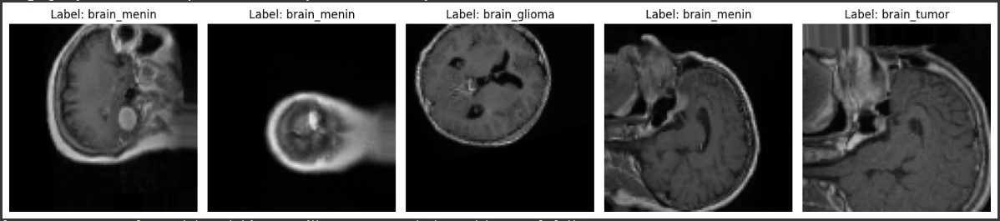
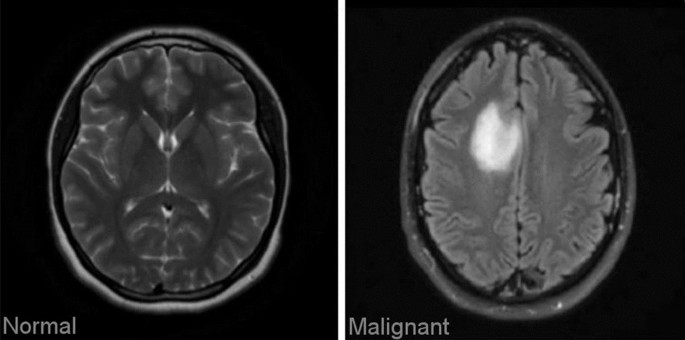
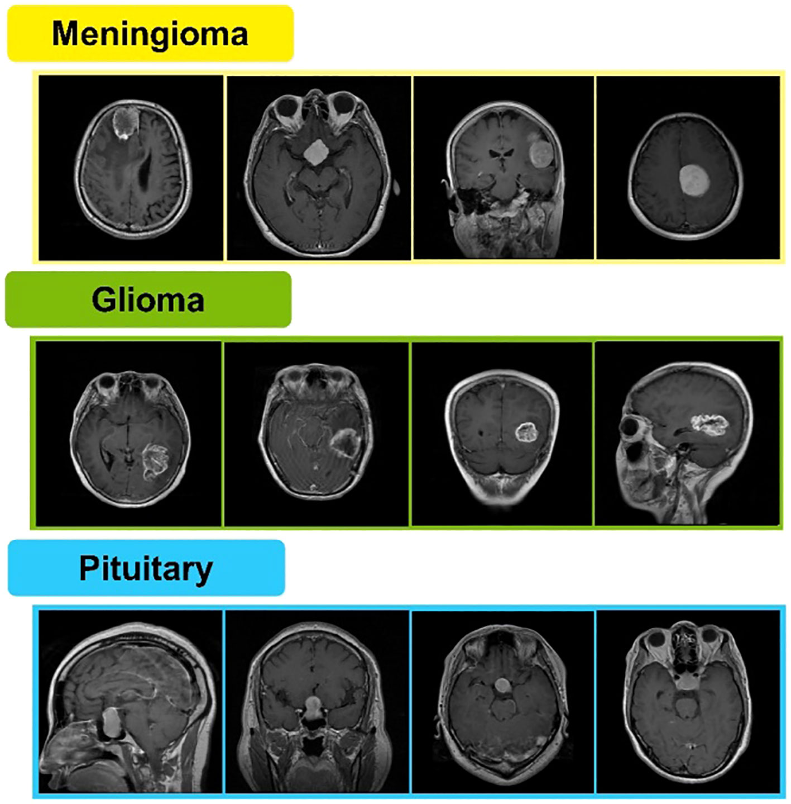
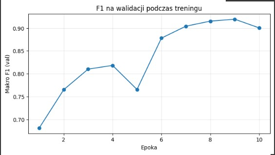
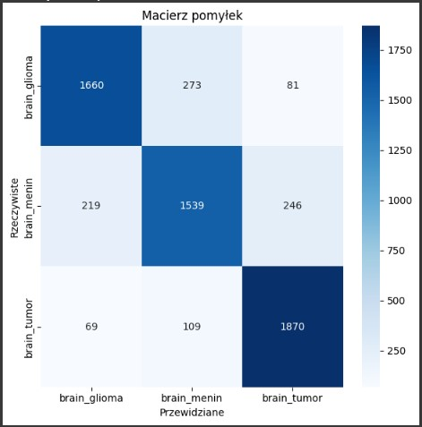

---
# Projekt-Koncowy 🧠
---

---
# Agenda  
1. Cel stworzenia modelu
2. Zastosowane techniki
3. Dane i klasy guzów mózgu
4. Wizualizacja guzów mózgu 
5. Wyniki modelu (Optuna + CNN)
6. Kluczowe wnioski
7. Podsumowanie i rekomendacje

---
# 1. Cel stworzenia modelu
Celem projektu było opracowanie modelu głębokiego uczenia (Convolutional Neural Network, CNN), który automatycznie klasyfikuje obrazy MRI mózgu na trzy typy guzów: 
- glioma
- meningioma
- guzy przysadki

- Model ma wspomóc diagnostykę radiologiczną poprzez: przyspieszenie procesu analizy obrazów,zwiększenie dokładności klasyfikacji, dostarczenie interpretowalnych wyników (np. macierz pomyłek, F1 per klasa).
Dodatkowo, projekt pokazuje jak można wykorzystać Optunę do automatycznej optymalizacji hiperparametrów, co zwiększa wiarygodność i powtarzalność wyników.
---
# 2. Zastosowane techniki
- Convolutional Neural Network (CNN) – standard w analizie obrazów medycznych.
- Optuna – automatyczna optymalizacja hiperparametrów (learning rate, optimizer, liczba filtrów).
- Augmentacja danych – rotacje, przesunięcia, zmiany jasności → poprawa uogólniania.
- Normalizacja – stabilizuje uczenie.
- BatchNormalization – przyspiesza zbieżność i stabilizuje gradienty.
- Dropout – redukuje ryzyko przeuczenia.
- EarlyStopping + ReduceLROnPlateau – zatrzymują trening w odpowiednim momencie i dostosowują learning rate.
- MLflow – śledzenie eksperymentów i logowanie wyników.
- tf.data.Dataset – wydajne ładowanie i przetwarzanie danych.
---
# 3. Dane i klasy guzów mózgu
---
# Przykłady obrazów używanych przez model 
- Takie przykłady służą do zobrazowania różnicy między zdrowymi i chorymi skanami w zadaniu automatycznej klasyfikacji czy wspomagania diagnostyki.
- Klasy gózów mózgu
- brain_glioma – Zawiera obrazy guzów glejowych, które powstają z komórek glejowych w mózgu. Mogą mieć różny stopień złośliwości.
- brain_menin – Zawiera obrazy meningiomów, czyli nowotworów wywodzących się z opon mózgowych. Często są łagodne, ale ich położenie może powodować poważne komplikacje.
- brain_tumor – Prawdopodobnie folder zawiera mieszane przypadki różnych nowotworów mózgu, bez podziału na konkretny typ.

- **Wizualizacja:**

---
# 4. Wizualizacja guzów mózgu 
---
- # Wizualizacja zdrowy mózg i chory mózg
- Opis zdjęcia – porównanie obrazów MRI mózgu: Na ilustracji widzimy dwa obrazy MRI mózgu zestawione obok siebie w celu porównania.
Po lewej stronie znajduje się obraz oznaczony jako „Normal” – przedstawia zdrowy mózg, w którym struktury są symetryczne i nie widać żadnych nieprawidłowości ani zmian chorobowych.
Po prawej stronie znajduje się obraz oznaczony jako „Malignant” – przedstawia mózg z widoczną zmianą nowotworową. Jasny, nieregularny obszar wskazuje na obecność guza, który zaburza prawidłową strukturę tkanki mózgowej.

- Różnice między wizualizacjami:
W obrazie normalnym tkanki są równomierne, bez wyraźnych ognisk czy asymetrii.
W obrazie złośliwym widoczny jest jasny, nieregularny obszar, który odróżnia się od reszty tkanki – to właśnie zmiana nowotworowa.
Kontrast między tymi dwoma obrazami pozwala łatwo zauważyć, jak guz wpływa na strukturę mózgu i jak bardzo różni się od obrazu zdrowego.

- **Wizualizacja:**

---
- # Wizualizacja klasyfikacja guzów mózgu
- Opis zdjęcia – rodzaje guzów mózgu na obrazach MRI: Na ilustracji przedstawiono przykładowe obrazy MRI mózgu, podzielone na trzy grupy w zależności od rodzaju guza:
- Meningioma (żółty nagłówek) – guzy zlokalizowane przy powierzchni mózgu, często w pobliżu opon mózgowych. Na obrazach widać je jako wyraźnie odgraniczone zmiany, zwykle przylegające do krawędzi mózgu.
- Glioma (zielony nagłówek) – guzy umiejscowione wewnątrz tkanki mózgowej. Mają nieregularne kształty i mogą rozprzestrzeniać się w głąb mózgu, co sprawia, że trudniej je jednoznacznie odgraniczyć.
- Pituitary (niebieski nagłówek) – guzy przysadki mózgowej, zlokalizowane w centralnej, dolnej części mózgu. Na obrazach widoczne są jako zmiany w rejonie siodła tureckiego, w pobliżu podstawy czaszki.

- Różnice między wizualizacjami:
- Meningioma – guzy bardziej powierzchowne, dobrze widoczne przy krawędzi mózgu.
- Glioma – guzy wewnętrzne, o nieregularnych granicach, trudniejsze do jednoznacznego odróżnienia od zdrowej tkanki.
- Pituitary – guzy zlokalizowane centralnie, w okolicy przysadki, różniące się położeniem od pozostałych typów.

- **Wizualizacja:**

---
# 4. Wyniki modelu (Optuna + CNN)
---

# Wykres dokładność modelu 
- Na wykresie przedstawiono, jak zmieniała się dokładność modelu w trakcie procesu uczenia.
- Niebieska linia pokazuje dokładność na zbiorze treningowym (Train acc) – czyli jak dobrze model radzi sobie na danych, na których się uczy. 
- Pomarańczowa linia pokazuje dokładność na zbiorze walidacyjnym (Val acc) – czyli jak dobrze model generalizuje na nowych danych, których wcześniej nie widział.

- **Wizualizacja:**

---
# Wykres krzywe strat 

- Na wykresie przedstawiono przebieg straty (loss) modelu uczenia maszynowego w trakcie treningu.
- Obie krzywe mają tendencję spadkową, co oznacza, że model uczy się i poprawia swoje wyniki w kolejnych epokach.
- 🔵 Niebieska linia pokazuje stratę na zbiorze treningowym (Train loss) – czyli jak dobrze model uczy się na danych, które zna.
- 🟠 Pomarańczowa linia pokazuje stratę na zbiorze walidacyjnym (Val loss) – czyli jak dobrze model radzi sobie na nowych danych, których wcześniej nie widział.

- **Wizualizacja:**

---
# Wykres heatmap (validation)
- Na tej heatmapie widzimy macierz pomyłek, która pokazuje, jak model klasyfikuje obrazy. Oś pozioma to przewidywania modelu, a oś pionowa to rzeczywiste etykiety. Każdy kwadrat
  przedstawia liczbę przypadków – im ciemniejszy kolor, tym więcej przykładów. Najważniejsze są wartości na przekątnej, bo oznaczają poprawne klasyfikacje.
  Widzimy, że model dobrze rozpoznaje większość przypadków, ale zdarzają się pomyłki, szczególnie przy rozróżnianiu glioma i meningioma.

- **Wizualizacja:**

---
# Wykres F1 na walidacji podczas treningu
- Na wykresie przedstawiono, jak zmieniała się miara F1 (dokładniej: makro F1) modelu w trakcie procesu uczenia.
- Niebieska linia przedstawia przebieg wartości F1 w kolejnych epokach – czyli jak zmieniała się skuteczność modelu w trakcie uczenia.
- 🔵 Punkty naniesione na linię oznaczają konkretne wartości F1 w danej epoce – dzięki nim łatwo można odczytać i porównać wyniki między poszczególnymi etapami treningu.
- Opis wykresu F1 na walidacji podczas treningu: Na wykresie przedstawiono, jak zmieniała się miara F1 (dokładniej: makro F1) modelu w trakcie procesu uczenia.
- Widać lekkie wahania (np. spadek w epoce 5), ale ogólny trend jest wzrostowy, a od około 6. epoki wartości stabilizują się na wysokim poziomie.
- To sugeruje, że model osiągnął dobrą jakość i potrafi skutecznie klasyfikować dane walidacyjne.
  
- **Wizualizacja:**

---
# Heatmapa confiusion matrix  (test)
- Na tej heatmapie widzimy macierz pomyłek, która pokazuje, jak model klasyfikuje obrazy. Oś pozioma to przewidywania modelu,
  a oś pionowa to rzeczywiste etykiety. Każdy kwadrat przedstawia liczbę przypadków – im ciemniejszy kolor, tym więcej przykładów.
  Najważniejsze są wartości na przekątnej, bo oznaczają poprawne klasyfikacje. Widzimy, że model dobrze rozpoznaje większość przypadków,
  ale zdarzają się pomyłki, szczególnie przy rozróżnianiu glioma i meningioma.

- **Wizualizacja:**

---
# Wykres rozkład przewidzianych klas (test)
- Na tym histogramie widzimy, jak model rozłożył swoje przewidywania pomiędzy trzy klasy guzów mózgu. Oś pozioma przedstawia klasy, 
a oś pionowa liczbę próbek. Każdy słupek pokazuje, ile przypadków model przypisał do danej klasy – najwięcej do meningioma, mniej do tumor, 
a najmniej do glioma. Dzięki temu możemy zobaczyć, czy model równomiernie rozpoznaje wszystkie klasy, 
czy też ma tendencję do częstszego wybierania jednej z nich.

- **Wizualizacja:**

---
# Heatmapa macierz pomyłek 
- Na tej heatmapie widzimy macierz pomyłek, która pokazuje, jak model klasyfikuje obrazy.
  Oś pozioma to przewidywania modelu, a oś pionowato rzeczywiste etykiety.
  Każdy kwadrat przedstawia liczbę przypadków – im ciemniejszy kolor, tym więcej przykładów. Najważniejsze są wartości na przekątnej,bo oznaczają poprawne klasyfikacje.
  Widzimy, że model dobrze rozpoznaje większość przypadków, ale zdarzają się pomyłki, szczególnie przy rozróżnianiu glioma i meningioma.

- **Wizualizacja:**

---
# 5. Kluczowe wnioski
---
# Kluczowe wnioski
- Augmentacja danych znacząco poprawia skuteczność.
- BatchNormalization + Dropout → stabilność i dokładność.
- Optuna pozwoliła dobrać optymalne hiperparametry (najlepszy wynik przy learning rate ≈ 1e-3).
- F1-macro i confusion matrix pokazują, że model dobrze radzi sobie z wszystkimi klasami, choć najtrudniejsze są przypadki guzów przysadki.
- System działa stabilnie nawet przy ograniczonym zbiorze danych.

---
# 6. Podsumowanie i rekomendacje
---
# Podsumowanie i rekomendacje
- Projekt z sukcesem stworzył dokładny i dobrze uogólniający model CNN do klasyfikacji guzów mózgu na podstawie obrazów MRI. System został:
przetestowany na rzeczywistych danych (BraTS),
wsparty narzędziami śledzenia eksperymentów (MLflow),
rozszerzony o interpretowalne wyniki (confusion matrix, F1 per klasa, histogramy).
- Rekomendacje na przyszłość:
Skalowanie na większe i bardziej zróżnicowane zbiory MRI (np. 3D NIfTI).
Wykorzystanie modeli przetrenowanych (EfficientNet, ResNet).
Integracja z systemem PACS szpitalnym.
Rozszerzenie o segmentację (lokalizacja guza).
---

  

  

