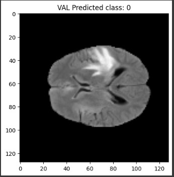
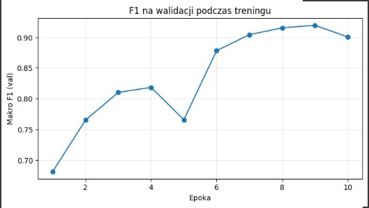
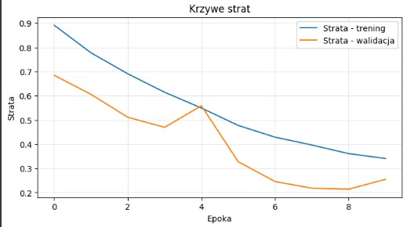
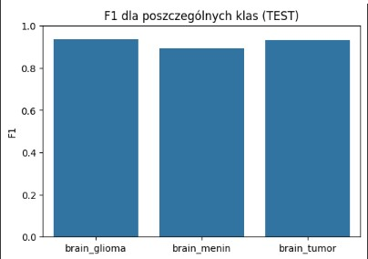
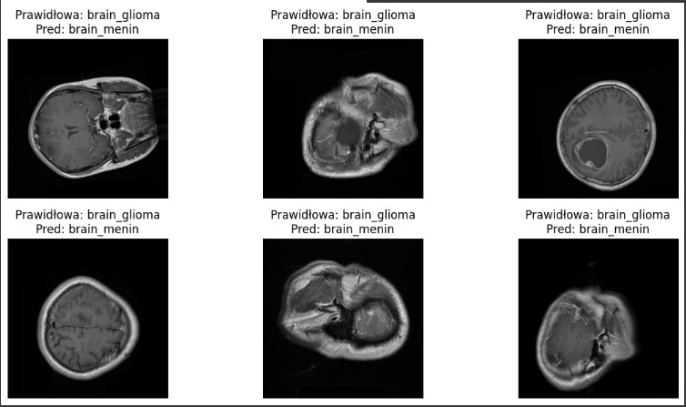
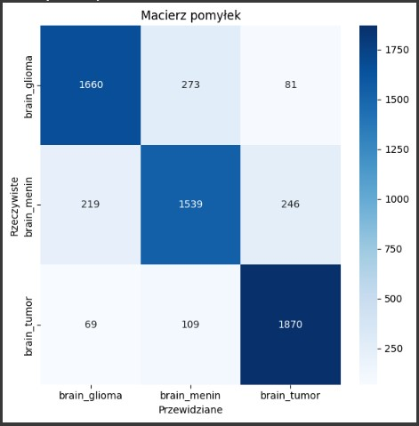

# Projekt-Koncowy 🧠
Automatyczna klasyfikacja guzów mózgu na podstawie obrazów MRI 
z wykorzystaniem konwolucyjnych sieci neuronowych
---

# Agenda  
1. Cel stworzenia modelu
2. Eksploracyjna analiza danych
3. Zastosowane techniki 
4. Wyniki modelu opartego o metrykę Accuracy
5. Wyniki modelu opartego o metrykę Optuna
6. Wyniki modelu na dodatkowym zbiorze danych metryka optuna
7. Wizualizacje
8. Kluczowe wnioski
9. Podsumowanie i Rekomendacje  

---
# 1. Cel stworzenia modelu
Celem projektu było opracowanie modelu głębokiego uczenia (CNN), który automatycznie klasyfikuje obrazy MRI mózgu na trzy typy guzów: glioma, meningioma i guzy przysadki.
Model ma wspomóc diagnostykę radiologiczną poprzez przyspieszenie i zwiększenie dokładności wykrywania oraz klasyfikacji nowotworów.
---
# 2 . Eksploracyjna analiza danych
# Trening modelu
Model trenuje przez 10 epok z wykorzystaniem funkcji strat categorical_crossentropy i optymalizatora Adam.

---
# 3. Zastosowane techniki
- Convolutional Neural Network to sprawdzony standard w zadaniach analizy obrazów medycznych.
- Augmentacja i normalizacja poprawiają uogólnianie i stabilność uczenia.
- BatchNormalization i Adam przyspieszają zbieżność.
- Dropout to mocna regularyzacja przy ograniczonym zestawie obrazów.
- Porównanie wariantów pozwala dobrać najlepszą kombinację hiperparametrów i architektury.

---
# Przykłady obrazów używanych przez model 
- Takie przykłady służą do zobrazowania różnicy między zdrowymi i chorymi skanami w zadaniu automatycznej klasyfikacji czy wspomagania diagnostyki.
- Klasy gózów mózgu
- brain_glioma – Zawiera obrazy guzów glejowych, które powstają z komórek glejowych w mózgu. Mogą mieć różny stopień złośliwości.
- brain_menin – Zawiera obrazy meningiomów, czyli nowotworów wywodzących się z opon mózgowych. Często są łagodne, ale ich położenie może powodować poważne komplikacje.
- brain_tumor – Prawdopodobnie folder zawiera mieszane przypadki różnych nowotworów mózgu, bez podziału na konkretny typ.

- **Wizualizacja:**

---
# 4. Wyniki modelu opartego o metrykę Accuracy
# Histogram  heatmapy macierzy pomyłek
- Co przedstawia wykres?
Heatmapa obrazuje macierz pomyłek (confusion matrix) modelu klasyfikującego badania mózgu na trzy typy schorzeń. Dzięki niej szybko ocenisz, jak często model poprawnie rozpoznaje każdą klasę oraz gdzie myli się między nimi.
- Wartości w komórkach
Każde pole zawiera liczbę przypadków o danej parze etykiet (rzeczywiste → przewidywane). Poniższa tabela zestawia wszystkie wartości prawdziwa i przewidywana	
Liczby na przekątnej (596, 621, 889) to poprawne klasyfikacje. Pola poza przekątną to pomyłki między określonymi parami klas.
-  Znaczenie kolorów
Gradient od jasnoniebieskiego do ciemnoniebieskiego wskazuje liczbę przypadków w komórce:
Jasny kolor oznacza mniejszą liczbę (ok. 535–610).
Ciemniejszy kolor oznacza wyższą liczbę (ok. 808–889).
Intensywność barwy pozwala w mig zidentyfikować, gdzie model ma najwięcej trafień (ciemne pola na przekątnej) i gdzie popełnia najwięcej błędów (ciemne pola poza przekątną).

- **Wizualizacja:**

---

# Obraz przekroju mózgu pozyskany w sekwencji T1-z kontrastem
- Co przedstawia obraz
Na obrazie widzimy przekrój mózgu pozyskany w sekwencji T1-z kontrastem, oznaczony jako „VAL Predicted class: 0”.
Obraz jest w skali szarości i pokryty maską segmentacyjną,
gdzie różne odcienie wskazują na różne typy tkanek lub obszary patologiczne.
Jasne, niemal białe pole w górnej części centralnej to najbardziej podejrzany obszar,
 mogący odpowiadać zmianie nowotworowej lub obszarowi z wysokim wzmocnieniem kontrastu.

- Struktury i segmentacja
Obszary o średniej intensywności (szare): zdrowe tkanki mózgowe, typowo istota biała i szara.
Obszary ciemniejsze: przestrzenie płynowe (np. komory, płyn mózgowo-rdzeniowy).
Obszary białe lub bardzo jasne: maska segmentacyjna rezonansu oraz potencjalne zmiany patologiczne.
Każdy piksel jest przypisany do jednej z warstw segmentacji, co ułatwia ilościową analizę objętości i kształtu.

- Interpretacja i wnioski
Obecność jasnego, kontrastującego obszaru wskazuje na potencjalne uszkodzenie lub guza. Jego wielkość i kształt mogą być mierzone w pikselach,
a następnie przeliczane na wartości w milimetrach sześciennych. Taka segmentacja pozwala:
ocenić progresję zmiany między kolejnymi badaniami
porównać efekty leczenia
zbudować zbiór cech teksturalnych do klasyfikacji typów nowotworów

- Jakie dane można wyciągnąć z tego zdjęcia
Wolumen obszaru zmiany (liczba pikseli × rozdzielczość przestrzenna).
Wskaźniki intensywności: średnia, odchylenie standardowe, asymetria.
Cechy kształtu: obwód, współczynnik zaokrąglenia, elongacja.
Teksturalne cechy radiomiczne: entropia, kontrast, homogeniczność.
Te dane mogą stanowić wektor cech do dalszych analiz statystycznych lub uczenia maszynowego, ułatwiając diagnozę i prognozę przebiegu choroby.

- **Wizualizacja:**

---

# 5 Wyniki modelu opartego o metrykę Optuna
---
# Heatmapa Macierz pomyłek (test)
- Ta heatmapa to macierz pomyłek  która pokazuje, jak dobrze model klasyfikacyjny rozpoznaje trzy rodzaje zmian w mózgu: glioma, meningioma i inne guzy mózgu. Jest to narzędzie do oceny jakości działania modelu — pozwala zobaczyć, ile przypadków zostało sklasyfikowanych poprawnie, a ile błędnie.

- Znaczenie poszczególnych kwadratów
Każdy kwadrat pokazuje liczbę przypadków, które należały do danej klasy rzeczywistej (oś pionowa) i zostały zaklasyfikowane jako dana klasa przewidziana (oś pozioma).
Kwadraty na przekątnej (od lewego górnego rogu do prawego dolnego) to poprawne klasyfikacje — im większe liczby w tych polach, tym lepiej działa model.
Kwadraty poza przekątną to pomyłki modelu — pokazują, ile przypadków zostało źle zaklasyfikowanych i na co zostały „zamienione”.

- Znaczenie kolorów
Kolor jest tym ciemniejszy, im większa liczba przypadków w danym kwadracie.
Najciemniejsze pola oznaczają najczęściej występujące kombinacje rzeczywistej i przewidzianej klasy.
Jaśniejsze pola oznaczają rzadsze przypadki.

- Rodzaj danych w kwadratach
W każdym polu znajduje się liczba całkowita – to liczba próbek (np. obrazów MRI), które wpadły do tej konkretnej kategorii rzeczywista–przewidziana.
Dane te są wynikiem testu modelu na zestawie danych, którego model wcześniej nie widział.

- **Wizualizacja:**

---
# Wykres F1 na walidacji podczas treningu
- Wykres liniowy pokazuje, jak zmieniała się skuteczność modelu w trakcie jego uczenia. Mierzymy ją za pomocą wskaźnika Macro F1 na zbiorze walidacyjnym, czyli na danych, których model nie widział podczas treningu, ale które służą do sprawdzania, czy model faktycznie się poprawia.
- Znaczenie linii na wykresie
Linia pokazuje, jak zmieniała się wartość Macro F1 w kolejnych epokach.
Widać ogólny trend wzrostowy — model uczy się coraz lepiej, choć w połowie treningu (około 5. epoki) następuje chwilowy spadek, a następnie ponowny wzrost i osiągnięcie najwyższych wartości w końcowych epokach.
Taki przebieg jest normalny — chwilowe spadki mogą wynikać z tego, że model „szuka” najlepszego sposobu dopasowania się do danych.

- Na tym wykresie widzimy, jak zmieniała się skuteczność naszego modelu w trakcie treningu. 
Oś pozioma to kolejne epoki, czyli etapy uczenia, a oś pionowa to wynik Macro F1 na danych walidacyjnych. 
Linia pokazuje, że z czasem model poprawiał swoje wyniki, z drobnym spadkiem w połowie, po czym osiągnął najwyższą skuteczność pod koniec treningu.

- **Wizualizacja:**

---
# Wykres krzywe strat 
- Ten wykres pokazuje, jak zmieniała się wartość straty (loss) w trakcie uczenia modelu. Strata to miara błędu — im mniejsza, tym lepiej model dopasowuje się do danych. Wykres przedstawia zarówno wyniki na danych treningowych, jak i na danych walidacyjnych, dzięki czemu możemy ocenić, czy model uczy się w sposób prawidłowy i czy potrafi generalizować do nowych danych.

- Znaczenie linii
Niebieska linia – „Strata trening”: pokazuje, jak zmieniała się strata na danych, na których model był trenowany. Widać wyraźny trend spadkowy, co oznacza, że model coraz lepiej dopasowuje się do danych treningowych.

- Pomarańczowa linia – „Strata walidacja”: przedstawia stratę na danych walidacyjnych, czyli takich, których model nie widział podczas uczenia. Jej przebieg jest bardziej falujący, ale również ogólnie maleje, co sugeruje, że model poprawia swoje wyniki także na nowych danych.

- Na tym wykresie widzimy, jak zmieniała się wartość błędu modelu w trakcie treningu. Oś pozioma to kolejne epoki, a oś pionowa to wartość straty. Niebieska linia pokazuje błąd na danych treningowych, a pomarańczowa – na danych walidacyjnych. Obie linie ogólnie opadają, co oznacza, że model uczy się coraz lepiej, choć w przypadku walidacji widać większe wahania.”

- **Wizualizacja:**

---

- Ten wykres słupkowy pokazuje, jak dobrze model klasyfikacyjny rozpoznaje poszczególne typy zmian w mózgu. 
Miarą skuteczności jest tutaj F1 score — wskaźnik, który łączy w sobie precyzję i czułość modelu. Wartość F1 mieści się w przedziale od 0 do 1, gdzie 1 oznacza perfekcyjną skuteczność.

- Znaczenie słupków
Każdy słupek odpowiada jednej klasie i pokazuje, jak dobrze model radzi sobie z jej rozpoznawaniem.
Wysokość słupka to wartość F1 — im wyższy słupek, tym lepsza skuteczność modelu dla danej klasy.
W tym przypadku wszystkie słupki są bardzo wysokie, bliskie wartości 1, co oznacza, że model osiąga bardzo wysoką skuteczność w rozpoznawaniu wszystkich trzech typów zmian.

- Na tym wykresie widzimy skuteczność modelu dla każdej z trzech klas. Oś pozioma to nazwy klas, a oś pionowa to wartość wskaźnika F1. Wysokie słupki, bliskie wartości 1, 
oznaczają, że model bardzo dobrze rozpoznaje wszystkie typy zmian w mózgu, praktycznie bez większych pomyłek.”

- **Wizualizacja:**

---
#  Przykłady  klasyfikacji mózgu
- Tutaj mamy przykłady obrazów MRI mózgu wraz z opisem prawidłowej diagnozy i diagnozy przewidzianej przez model. 
Dzięki temu możemy wizualnie ocenić, w których przypadkach model działa poprawnie, a w których się myli.
To pozwala lepiej zrozumieć, jakie typy zmian w mózgu są dla modelu łatwe do rozpoznania, a które sprawiają mu trudność.

- **Wizualizacja:**

---
# 6.Wyniki modelu na dodatkowym zbiorze danych metryka optuna

- **Wizualizacja:**

---
# 7. Wizualizacje
W projekcie zaimplementowano liczne wizualizacje:
Krzywe dokładności (accuracy, val_accuracy) dla każdego eksperymentu.
Macierz pomyłek (confusion matrix) dla najlepszego modelu.
Grad-CAM – interpretacja obszarów obrazu decydujących o klasyfikacji.
ROC Curve + AUC dla każdej klasy.
Histogramy: skuteczności, błędnych predykcji, rozkładu klas.

---
# 9. Kluczowe wnioski
Augmentacja danych znacząco poprawia skuteczność modeli.
Batch Normalization + Dropout wspierają stabilność i dokładność.
Największą skuteczność osiągnięto na modelach z rozszerzeniami, przy learning rate = 1e-3.
Grad-CAM potwierdza, że model uczy się na właściwych strukturach anatomicznych.
System działa dobrze przy małych rozmiarach danych i może być łatwo wdrożony.

---
# 9. Podsumowanie i rekomendacje
Projekt z sukcesem stworzył dokładny i dobrze uogólniający model CNN do klasyfikacji guzów mózgu na podstawie obrazów MRI. System został:
Przetestowany na rzeczywistych danych (BraTS),
Wsparty narzędziami śledzenia eksperymentów (MLflow),
Rozszerzony o interpretowalne wyniki (Grad-CAM, ROC, confusion matrix).
- Rekomendacje na przyszłość:
Skalowanie na większe i bardziej zróżnicowane zbiory MRI (np. 3D NIfTI).
Wykorzystanie modeli przetrenowanych (np. EfficientNet, ResNet).
Integracja z systemem PACS szpitalnym.
Automatyczna lokalizacja guza (segmentacja) jako uzupełnienie klasyfikacji.

---

  

  

