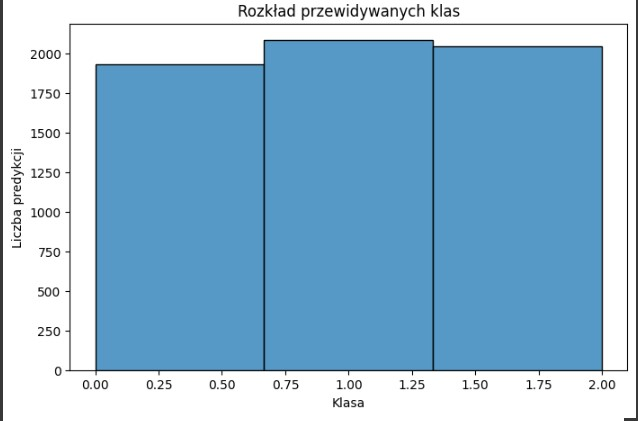
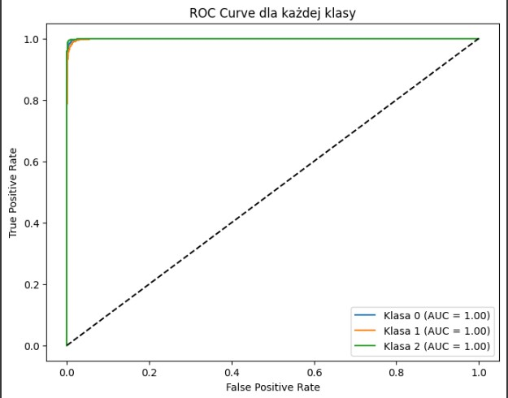

# Projekt-Koncowy 🧠
Automatyczna klasyfikacja guzów mózgu na podstawie obrazów MRI 
z wykorzystaniem konwolucyjnych sieci neuronowych
---

# Agenda  
1. Cel stworzenia modelu
2. Dane i wstępne przetwarzanie
3. Eksploracyjna analiza danych
4. Wyniki modelu bez zroszeżeń
5. Wyniki modelu z roszerzeniami
6. Wizualizacje
7. Kluczowe wnioski
8. Podsumowanie i Rekomendacje  

---
# 1. Cel stworzenia modelu
Celem projektu było opracowanie modelu głębokiego uczenia (CNN), który automatycznie klasyfikuje obrazy MRI mózgu na trzy typy guzów: glioma, meningioma i guzy przysadki.
Model ma wspomóc diagnostykę radiologiczną poprzez przyspieszenie i zwiększenie dokładności wykrywania oraz klasyfikacji nowotworów.
---
# 2. Dane i wstępne przetwarzanie
Dane podzielone zostały na zbiory: train, validation, test w strukturze katalogowej.
Obrazy były skalowane do rozmiaru 128x128 pikseli i przeskalowane wartościami rescale=1./255.
Wykorzystano augmentację danych (obrót, przesunięcia, zoom, odbicia), co zwiększa różnorodność zbioru treningowego i ogranicza przeuczenie.

---
# 3. Eksploracyjna analiza danych
# Trening modelu
Model trenuje przez 10 epok z wykorzystaniem funkcji strat categorical_crossentropy i optymalizatora Adam.

- Kod:  
  ```python
  history = model.fit(train_data, validation_data=val_data, epochs=10)

---
# Eksperymenty
Przeprowadzono kilka wariantów eksperymentów z różnymi parametrami:

| Nazwa eksperymentu | Augmentacja | Wariant modelu     | Learning Rate |
| ------------------ | ----------- | ------------------ | ------------|
| A_basic_aug      | TAK           | baseline            | 1e-3         |
| B_no_aug         | TAK           | baseline            | 1e-3         |
| C_dropout        | TAK           | dropout             | 1e-3         |
| D_batchnorm      | TAK           | batch normalization | 1e-3         |
| E_lr_low         | TAK           | baseline            | 1e-4         |

---
# Porównanie modeli
Każdy model był oceniany na podstawie wartości val_accuracy. Wyniki zostały zwizualizowane na wspólnym wykresie.

---
# Ewaluacja najlepszego modelu
- Macierz pomyłek (confusion matrix)
- Raport klasyfikacji (precision, recall, f1-score)

---
# Ewaluacja najlepszej wersji
- Wybór najlepszego wariantu – Na podstawie maksymalnej wartości val_accuracy.
- Testowanie na zbiorze testowym – Predykcje → macierz pomyłek (confusion_matrix) + raport klasyfikacji (precision, recall, f1-score). 
– Dlaczego: pozwala zobaczyć, które klasy są mylone i jak model radzi sobie z różnymi typami guzów.

----
# Dlaczego zastosowano te techniki
- Convolutional Neural Network to sprawdzony standard w zadaniach analizy obrazów medycznych.
- Augmentacja i normalizacja poprawiają uogólnianie i stabilność uczenia.
- BatchNormalization i Adam przyspieszają zbieżność.
- Dropout to mocna regularyzacja przy ograniczonym zestawie obrazów.
- Porównanie wariantów pozwala dobrać najlepszą kombinację hiperparametrów i architektury.

---
# Przykłady obrazów używanych przez model 
- Takie przykłady służą do zobrazowania różnicy między zdrowymi i chorymi skanami w zadaniu automatycznej klasyfikacji czy wspomagania diagnostyki.

- Klasy gózów mózgu
- brain_glioma – Zawiera obrazy guzów glejowych, które powstają z komórek glejowych w mózgu. Mogą mieć różny stopień złośliwości.
- brain_menin – Zawiera obrazy meningiomów, czyli nowotworów wywodzących się z opon mózgowych. Często są łagodne, ale ich położenie może powodować poważne komplikacje.
- brain_tumor – Prawdopodobnie folder zawiera mieszane przypadki różnych nowotworów mózgu, bez podziału na konkretny typ.


- **Wizualizacja:**


---

# Histogram Skuteczności modelu
- Wykres dokładności treningu i walidacji

- Wykres ilustruje postęp w nauce modelu oraz porównuje jego wydajność na danych treningowych i walidacyjnych.
- Co z tego wynika?
– Jeśli obie linie rosną równolegle i niewiele się od siebie różnią, model dobrze generalizuje.
– Jeśli niebieska rośnie szybciej niż pomarańczowa (duży rozjazd), może występować przeuczenie (overfitting).


- **Wizualizacja:**


---
# 4. Wyniki modelu bez zroszeżeń
# Wyniki modelu bez rozszerzeń (baseline) Porównanie validation accuraci

- Ten histogram pokazuje rozkład dokładności modelu dla 10 epok treningu, z dodatkowymi liniami ilustrującymi trend.
- Linie: Niebieska linia: dokładność na zbiorze treningowym w kolejnych epokach. Rosnący kształt oznacza, że model uczy się coraz lepiej dopasowywać do danych treningowych. 
 Pomarańczowa linia: dokładność na zbiorze walidacyjnym (testowym). Porównując ją z niebieską, widzimy, jak model generalizuje na nowych danych. oraz podobny przebieg obu linii oznacza dobrą generalizację, większa rozbieżność to przeuczenie.”

- **Wizualizacja:**


---
# Wykres Macierzy Pomyłek

- To macierz pomyłek (confusion matrix) dla naszego modelu „B_no_aug”.
W każdej komórce widzisz liczbę próbek o danej prawdziwej (wiersz) i przewidywanej (kolumna) klasie.
– Komórki na przekątnej (np. w lewym górnym rogu 2001) to prawidłowe trafienia (true positives).
– Komórki poza przekątną to błędy klasyfikacji (np. 7 przypadków glioma zaklasyfikowano jako menin).
Ciemniejszy kolor oznacza większą liczbę przypadków, a pasek kolorów z boku pokazuje skalę od 0 do ~2000.

- **Wizualizacja:**


---

# 5. Wyniki modelu z rozszerzeniami 

Przeprowadzono serię eksperymentów z różnymi wariantami modelu:
Dropout: lepsze generalizowanie (redukcja przeuczenia).
Batch Normalization: stabilniejsze uczenie.
Niższe learning rate (1e-4): wolniejsze, ale potencjalnie dokładniejsze uczenie.
Bez augmentacji: widocznie gorsze wyniki – potwierdza wartość augmentacji.
- Najlepszy model:
Eksperyment D_batchnorm osiągnął najwyższy val_accuracy.
Model zapisany, oceniony na testowym zbiorze danych.
Zintegrowano z MLFLOW do śledzenia metryk.

---
# Histogram Macierz pomyłek (confusion matrix)

-  Co przedstawia wykres?
- To macierz pomyłek dla modelu klasyfikującego obrazy na trzy kategorie:
- Pozwala ocenić, jak często model poprawnie rozpoznaje każdą klasę i gdzie popełnia błędy.
- Każda kolumna pokazuje, ile próbek zostało zaklasyfikowanych jako dana etykieta.
- Każdy wiersz wskazuje, z której klasy pochodziły próbki.
- Co przedstawiają kwadraty i liczby
W każdym kwadracie znajduje się liczba próbek, które mają daną parę (prawdziwa klasa → przewidywana klasa).
- Przykładowe wartości:
W kwadracie na przecięciu wiersza brain_glioma i kolumny brain_glioma jest 522 – tyle przypadków glejaka poprawnie sklasyfikowano.
W przecięciu brain_glioma → brain_menin mamy 752 – tyle glejaków model uznał błędnie za oponiaki.
Analogicznie, np. brain_tumor → brain_tumor = 778 to prawidłowe rozpoznania guzów.
- Co oznaczają kolory?
Skala koloru od jasnobłękitnego (niskie wartości) do ciemnoniebieskiego (wysokie wartości).
Im ciemniejszy kwadrat, tym więcej próbek trafiło do tej kombinacji prawdziwej vs. przewidywanej klasy.
Kolory ułatwiają szybką identyfikację, gdzie model radzi sobie najlepiej (ciemne pola na przekątnej) i gdzie są największe pomyłki (poza przekątną).

- **Wizualizacja:**


---
# Macierz pomyłek (confusion matrix)

Heatmapa macierzy pomyłek (confusion matrix)
- Co przedstawia wykres?
To heatmapa macierzy pomyłek dla modelu klasyfikującego obrazy mózgu na trzy kategorie:
- brain_glioma
- brain_menin
- brain_tumor
Pozwala ocenić, jak często model poprawnie identyfikuje każdą klasę oraz gdzie najczęściej popełnia błędy.
-  Wartości w komórkach
W każdym kwadracie znajduje się liczba próbek o określonej parze (prawdziwa klasa → przewidywana klasa).

Kwadraty sumują się do całkowitej liczby próbek testowych i pokazują zarówno poprawne klasyfikacje (diagonalne), jak i pomyłki (poza przekątną).

-  Kolory – co oznaczają
Skala kolorów biegnie od jasnoniebieskiego (niższe liczby, ok. 660) do ciemnoniebieskiego (wyższe liczby, ok. 700).
Im ciemniejszy kwadrat, tym więcej przykładów trafiło do tej kategorii.
Kolory ułatwiają szybkie zlokalizowanie mocnych i słabych punktów modelu:
ciemne pola na przekątnej → dużo poprawnych rozpoznań,
ciemne pola poza przekątną → dużo pomyłek między konkretnymi klasami.

- **Wizualizacja:**


---

# Histogram  heatmapy macierzy pomyłek
- Co przedstawia wykres?
Heatmapa obrazuje macierz pomyłek (confusion matrix) modelu klasyfikującego badania mózgu na trzy typy schorzeń. Dzięki niej szybko ocenisz, jak często model poprawnie rozpoznaje każdą klasę oraz gdzie myli się między nimi.
- Wartości w komórkach
Każde pole zawiera liczbę przypadków o danej parze etykiet (rzeczywiste → przewidywane). Poniższa tabela zestawia wszystkie wartości prawdziwa i przewidywana	
Liczby na przekątnej (596, 621, 889) to poprawne klasyfikacje. Pola poza przekątną to pomyłki między określonymi parami klas.
-  Znaczenie kolorów
Gradient od jasnoniebieskiego do ciemnoniebieskiego wskazuje liczbę przypadków w komórce:
Jasny kolor oznacza mniejszą liczbę (ok. 535–610).
Ciemniejszy kolor oznacza wyższą liczbę (ok. 808–889).
Intensywność barwy pozwala w mig zidentyfikować, gdzie model ma najwięcej trafień (ciemne pola na przekątnej) i gdzie popełnia najwięcej błędów (ciemne pola poza przekątną).

- **Wizualizacja:**


---

# Szczegółowy opis wykresu: Macierz pomyłek (confusion matrix)
-  Co przedstawia wykres?
To heatmapa macierzy pomyłek klasyfikatora rozpoznającego trzy schorzenia mózgu:
Pozwala zobaczyć, ile próbek każdej prawdziwej klasy zostało poprawnie rozpoznanych, a ile przypisano błędnie do innych kategorii.


-  Wartości w komórkach
Wartość w każdym kwadracie to liczba próbek z danej pary:
prawdziwa klasa → przewidywana klasa
Liczby na przekątnej (149, 221, 1681) to poprawne klasyfikacje, pozostałe to pomyłki modelu.

-  Znaczenie kolorów
Gradient od jasnoniebieskiego (niższe wartości) do ciemnoniebieskiego (wyższe wartości).
Im ciemniejszy odcień, tym więcej próbek znalazło się w tej kombinacji prawdziwej vs. przewidywanej klasy.
Pozwala szybko zidentyfikować:
mocne strony modelu (ciemne pola na przekątnej)
obszary wymagające poprawy (ciemniejsze pola poza przekątną)

- **Wizualizacja:**


---
# Historgram  macierzy pomyłek
-  Ta heatmapa pokazuje, jak model klasyfikujący typy nowotworów mózgu radzi sobie na zestawie treningowym. Każdy kwadrat to liczba przypadków, w których prawdziwa klasa (wiersz) została przypisana do klasy przewidywanej (kolumna).
-  Wartości w kwadratach prawdziwa i przewidywana. Komórki na przekątnej (529, 490, 1050) to poprawne klasyfikacje.Pozostałe liczby to błędne przewidywania modelu.
-  Znaczenie kolorów
Gradient od jasnoniebieskiego do ciemnoniebieskiego odzwierciedla liczbę próbek:
Jasny odcień: niewiele przypadków w danej kombinacji
Ciemny odcień: dużo przypadków
Dzięki temu widać, gdzie model najczęściej trafia i gdzie się my

- **Wizualizacja:**


---
# Obraz przekroju mózgu pozyskany w sekwencji T1-z kontrastem
- Co przedstawia obraz
Na obrazie widzimy przekrój mózgu pozyskany w sekwencji T1-z kontrastem, oznaczony jako „VAL Predicted class: 0”.
Obraz jest w skali szarości i pokryty maską segmentacyjną,
gdzie różne odcienie wskazują na różne typy tkanek lub obszary patologiczne.
Jasne, niemal białe pole w górnej części centralnej to najbardziej podejrzany obszar,
 mogący odpowiadać zmianie nowotworowej lub obszarowi z wysokim wzmocnieniem kontrastu.

- Struktury i segmentacja
Obszary o średniej intensywności (szare): zdrowe tkanki mózgowe, typowo istota biała i szara.
Obszary ciemniejsze: przestrzenie płynowe (np. komory, płyn mózgowo-rdzeniowy).
Obszary białe lub bardzo jasne: maska segmentacyjna rezonansu oraz potencjalne zmiany patologiczne.
Każdy piksel jest przypisany do jednej z warstw segmentacji, co ułatwia ilościową analizę objętości i kształtu.

- Interpretacja i wnioski
Obecność jasnego, kontrastującego obszaru wskazuje na potencjalne uszkodzenie lub guza. Jego wielkość i kształt mogą być mierzone w pikselach,
a następnie przeliczane na wartości w milimetrach sześciennych. Taka segmentacja pozwala:
ocenić progresję zmiany między kolejnymi badaniami
porównać efekty leczenia
zbudować zbiór cech teksturalnych do klasyfikacji typów nowotworów

- Jakie dane można wyciągnąć z tego zdjęcia
Wolumen obszaru zmiany (liczba pikseli × rozdzielczość przestrzenna).
Wskaźniki intensywności: średnia, odchylenie standardowe, asymetria.
Cechy kształtu: obwód, współczynnik zaokrąglenia, elongacja.
Teksturalne cechy radiomiczne: entropia, kontrast, homogeniczność.
Te dane mogą stanowić wektor cech do dalszych analiz statystycznych lub uczenia maszynowego, ułatwiając diagnozę i prognozę przebiegu choroby.

- **Wizualizacja:**


---
# Histogram błędnych predykcji
 - To histogram ilustrujący porównanie liczby poprawnych i błędnych predykcji modelu klasyfikacyjnego. Pokazuje, jak wiele przypadków model sklasyfikował prawidłowo, a ile przypadków skategoryzował niewłaściwie.
- Oś pozioma (X) – Typ predykcji
Dwie kategorie:
Poprawne – liczba przypadków, w których model dokonał właściwej klasyfikacji
Błędne – liczba przypadków, w których model pomylił się w klasyfikacji
- Oś pionowa (Y) – Count
Pokazuje liczbę przypadków (obserwacji) dla każdej kategorii X.
Skala od 0 do 6 000, dostosowana tak, by uwzględnić zarówno dużą liczbę poprawnych, jak i relatywnie niewielką liczbę błędnych predykcji.
-Wysokość słupka odpowiada liczbie obserwacji w danej kategorii:
Słupek „Poprawne” sięga prawie do 6 000, co oznacza, że model dokonał prawidłowej klasyfikacji w niemal wszystkich przypadkach.
Słupek „Błędne” jest bardzo niski (kilkadziesiąt przypadków), co wskazuje na niewielki odsetek pomyłek.

- Interpretacja kluczowa
Dominacja poprawnych predykcji: model osiąga bardzo wysoką dokładność, co jest widoczne poprzez zdecydowaną przewagę słupka „Poprawne”.
Minimalna liczba błędów: niski słupek „Błędne” świadczy o skuteczności modelu i jego niezawodności w typowych scenariuszach.


- **Wizualizacja:**


---
# Ten histogram (wykres słupkowy) pokazuje, jak model klasyfikacyjny rozdzielił swoje predykcje pomiędzy trzy klasy:
- Klasa 0.00
- Klasa 1.00
- Klasa 2.00
- Wizualizacja pozwala ocenić, czy model przewiduje klasy równomiernie, czy też faworyzuje którąś z nich.

- Co oznaczają słupki?
Słupek dla klasy 0.00: ok. 1900 predykcji
Słupek dla klasy 1.00: ok. 2100 predykcji
Słupek dla klasy 2.00: ok. 2000 predykcji
Każdy słupek reprezentuje liczbę przypadków, w których model przypisał daną klasę jako wynik predykcji.

- Wnioski z wykresu
Model nie jest skrajnie niezrównoważony – wszystkie trzy klasy są przewidywane w podobnych ilościach.
Klasa 1.00 jest najczęściej przewidywana, co może wskazywać na jej dominację w danych treningowych lub większą pewność modelu w jej rozpoznawaniu.
Równomierny rozkład może świadczyć o dobrym wyważeniu modelu, ale warto sprawdzić, czy odpowiada rzeczywistej proporcji klas w danych.


- **Wizualizacja:**



---
# Wykre ROC Curve dla każdej klasy
- Ten wykres to krzywa ROC (Receiver Operating Characteristic), która pokazuje, jak dobrze model rozróżnia między klasami 0, 1 i 2. Każda linia odpowiada jednej klasie, a wartość AUC (Area Under the Curve) mówi o skuteczności klasyfikacji.

- Oś pozioma (False Positive Rate)
Pokazuje odsetek negatywnych przykładów błędnie zaklasyfikowanych jako pozytywne
Skala od 0.0 do 1.0
Im bliżej 0, tym mniej fałszywych alarmów

- Oś pionowa (True Positive Rate)
Pokazuje odsetek pozytywnych przykładów poprawnie rozpoznanych
Skala od 0.0 do 1.0
Im bliżej 1, tym więcej prawidłowych wykryć

- Linie i ich kolory
Klasa 0 (niebieska linia) – AUC = 1.00
Klasa 1 (pomarańczowa linia) – AUC = 1.00
Klasa 2 (zielona linia) – AUC = 1.00
Wszystkie linie biegną wzdłuż krawędzi od (0,0) do (0,1) i dalej do (1,1), co oznacza perfekcyjną separację klas.

- Co oznaczają wartości AUC?
AUC = 1.00 dla każdej klasy wskazuje na idealny model, który nigdy nie myli pozytywów z negatywami.
Brak kompromisów między czułością (TPR) a specyficznością (1 – FPR).

- **Wizualizacja:**



---
# 6. Wizualizacje
W projekcie zaimplementowano liczne wizualizacje:
Krzywe dokładności (accuracy, val_accuracy) dla każdego eksperymentu.
Macierz pomyłek (confusion matrix) dla najlepszego modelu.
Grad-CAM – interpretacja obszarów obrazu decydujących o klasyfikacji.
ROC Curve + AUC dla każdej klasy.
Histogramy: skuteczności, błędnych predykcji, rozkładu klas.

---
# 7. Kluczowe wnioski
Augmentacja danych znacząco poprawia skuteczność modeli.
Batch Normalization + Dropout wspierają stabilność i dokładność.
Największą skuteczność osiągnięto na modelach z rozszerzeniami, przy learning rate = 1e-3.
Grad-CAM potwierdza, że model uczy się na właściwych strukturach anatomicznych.
System działa dobrze przy małych rozmiarach danych i może być łatwo wdrożony.

---
# 8. Podsumowanie i rekomendacje
Projekt z sukcesem stworzył dokładny i dobrze uogólniający model CNN do klasyfikacji guzów mózgu na podstawie obrazów MRI. System został:
Przetestowany na rzeczywistych danych (BraTS),
Wsparty narzędziami śledzenia eksperymentów (MLflow),
Rozszerzony o interpretowalne wyniki (Grad-CAM, ROC, confusion matrix).
- Rekomendacje na przyszłość:
Skalowanie na większe i bardziej zróżnicowane zbiory MRI (np. 3D NIfTI).
Wykorzystanie modeli przetrenowanych (np. EfficientNet, ResNet).
Integracja z systemem PACS szpitalnym.
Automatyczna lokalizacja guza (segmentacja) jako uzupełnienie klasyfikacji.

---


  

  


