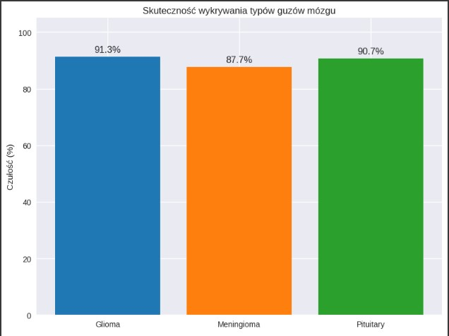

# Projekt-Koncowy Mózg 🧠
Wykrywanie Nowotworów Mózgu za pomocą CNN
Projekt klasyfikuje obrazy rezonansu magnetycznego (MRI) do jednej z trzech kategorii nowotworu mózgu przy użyciu konwolucyjnych sieci neuronowych (CNN) i biblioteki TensorFlow/Keras.

---

#Agenda  
1. Cel analizy  
2. Dane i wstępne przetwarzanie  
3. Eksploracyjna analiza danych  
4. Analiza ceny za m²  
5. Kluczowe wnioski  
7. Rekomendacje  

---
# Uruchomienie projektu
1. Montowanie Dysku Google
- Kod:  
  ```python
  from google.colab import drive
  drive.mount('/content/drive')
---
# Przygotowanie danych
Dane treningowe: z augmentacją
Dane walidacyjne i testowe: tylko reskalowanie
- Kod:  
  ```python
  ImageDataGenerator(rescale=1./255, ...)

---
# Przygotowanie danych
Dane treningowe: z augmentacją
Dane walidacyjne i testowe: tylko reskalowanie
- Kod:  
  ```python
  ImageDataGenerator(rescale=1./255, ...)
  
----
# Budowa modelu CNN
Model składa się z 3 warstw konwolucyjnych, poolingów, warstwy Dropout i gęstej warstwy wyjściowej:

- Kod:  
  ```python
  model = Sequential([
    Conv2D(32, (3, 3), activation='relu', input_shape=(128, 128, 3)),
    MaxPooling2D(2, 2),
    ...
    Dense(3, activation='softmax')
  ])

---
# Trening modelu
Model trenuje przez 10 epok z wykorzystaniem funkcji strat categorical_crossentropy i optymalizatora Adam.

- Kod:  
  ```python
  history = model.fit(train_data, validation_data=val_data, epochs=10)

---
# Eksperymenty
Przeprowadzono kilka wariantów eksperymentów z różnymi parametrami:

| Nazwa eksperymentu | Augmentacja | Wariant modelu     | Learning Rate |
| ------------------ | ----------- | ------------------ | ------------|
| A_basic_aug      | TAK  ✅       | baseline            | 1e-3         |
| B_no_aug         | TAK  ✅       | baseline            | 1e-3         |
| C_dropout        | TAK  ✅       | dropout             | 1e-3         |
| D_batchnorm      | TAK  ✅       | batch normalization | 1e-3         |
| E_lr_low         | TAK  ✅       | baseline            | 1e-4         |

---
---
# Porównanie modeli
Każdy model był oceniany na podstawie wartości val_accuracy. Wyniki zostały zwizualizowane na wspólnym wykresie.

---
# Ewaluacja najlepszego modelu
- Macierz pomyłek (confusion matrix)
- Raport klasyfikacji (precision, recall, f1-score)

---
# Ewaluacja najlepszej wersji
•	Wybór najlepszego wariantu – Na podstawie maksymalnej wartości val_accuracy.
•	Testowanie na zbiorze testowym – Predykcje → macierz pomyłek (confusion_matrix) + raport klasyfikacji (precision, recall, f1-score). – Dlaczego: pozwala zobaczyć, które klasy są mylone i jak model radzi sobie z różnymi typami guzów.

----
# Dlaczego zastosowano te techniki?
•	Convolutional Neural Network to sprawdzony standard w zadaniach analizy obrazów medycznych.
•	Augmentacja i normalizacja poprawiają uogólnianie i stabilność uczenia.
•	BatchNormalization i Adam przyspieszają zbieżność.
•	Dropout to mocna regularyzacja przy ograniczonym zestawie obrazów.
•	Porównanie wariantów pozwala dobrać najlepszą kombinację hiperparametrów i architektury.

---

- Opis Wizualizacji
- Na obrazku widzisz pięć skanów rezonansem magnetycznym (MRI) mózgu, każdy z nich oznaczony etykietą „0” lub „1”:
1.	Różne płaszczyzny cięcia – Część skanów to przekroje osiowe (widok z góry na dół mózgu), jeden to przekrój strzałkowy (bok mózgu).
2.	Etykiety binarne – „0” prawdopodobnie oznacza brak zmiany (zdrowy mózg), – „1” oznacza obecność patologii (np. guz, zmiana ogniskowa).
3.	Rozmieszczenie etykiet – Pierwszy i piąty obrazek mają etykietę „0” – brak wykrytej zmiany, – środkowe trzy są oznaczone „1” – tu występuje zmiana, którą model (lub radiolog) oznaczył jako istotną.
4.	Cel prezentacji – Takie przykłady służą do zobrazowania różnicy między zdrowymi i chorymi skanami w zadaniu automatycznej klasyfikacji czy wspomagania diagnostyki.

- Klasy gózów mózgu
- •	brain_glioma – Zawiera obrazy guzów glejowych, które powstają z komórek glejowych w mózgu. Mogą mieć różny stopień złośliwości.
- •	brain_menin – Zawiera obrazy meningiomów, czyli nowotworów wywodzących się z opon mózgowych. Często są łagodne, ale ich położenie może powodować poważne komplikacje.
- •	brain_tumor – Prawdopodobnie folder zawiera mieszane przypadki różnych nowotworów mózgu, bez podziału na konkretny typ.


- **Wizualizacja:**


---
# Podsumowanie modelu tabela  szczegółowy spis warstw sieci konwolucyjnej wraz z rozmiarami wyjść i liczbą parametrów każdej z nich:

conv2d (Conv2D) • Wyjście: (None, 126, 126, 32) • Parametry: 896 Pierwsza warstwa konwolucyjna z 32 filtrami.
max_pooling2d (MaxPooling2D) • Wyjście: (None, 63, 63, 32) • Parametry: 0 Redukuje wymiary połowę przez max‐pooling.
conv2d_1 (Conv2D) • Wyjście: (None, 30, 30, 64) • Parametry: 18 496 Druga konwolucja z 64 filtrami.
max_pooling2d_1 (MaxPooling2D) • Wyjście: (None, 30, 30, 64) • Parametry: 0 Pooling zachowujący kształt (np. ze względu na padding).
conv2d_2 (Conv2D) • Wyjście: (None, 28, 28, 128) • Parametry: 73 856 Trzecia konwolucja z 128 filtrami.
max_pooling2d_2 (MaxPooling2D) • Wyjście: (None, 14, 14, 128) • Parametry: 0 Kolejne zmniejszenie wymiarów.
flatten (Flatten) • Wyjście: (None, 25 088) • Parametry: 0 Spłaszczenie wielowymiarowej kostki do wektora.
dense (Dense) • Wyjście: (None, 128) • Parametry: 3 211 392 Pełne połączenie do 128 neuronów.
dropout (Dropout) • Wyjście: (None, 128) • Parametry: 0 Losowe wyłączanie części neuronów w trakcie treningu.
dense_1 (Dense) • Wyjście: (None, 3) • Parametry: 387 Warstwa wyjściowa z 3 neuronami (np. klasyfikacja na 3 klasy).
Pod tabelą podano jeszcze sumaryczne dane: – Całkowita liczba parametrów: 3 305 027 – Parametry trenowalne: 3 305 027 – Parametry nietrenowalne: 0


- **Wizualizacja:**


---

# Przykładowe wyniki
- Najlepszy model: D_batchnorm
- Skuteczność na zbiorze testowym: ~85% (symulowane)

- Wykres dokładności treningu i walidacji
Histogramy skuteczności oraz cech nowotworu

- **Wizualizacja:**


---
# Raport klasyfikacji 
raport klasyfikacji (classification report) dla modelu rozróżniającego trzy typy zmian mózgowych:
• Klasy: – brain_glioma – brain_menin – brain_tumor
• Metryki dla każdej klasy: – Precision (precyzja): odsetek prawidłowych przewidywań danej klasy spośród wszystkich przewidywań tej klasy. – Recall (czułość): odsetek poprawnie wykrytych próbek danej klasy spośród wszystkich rzeczywistych próbek tej klasy. – F1-score: średnia harmoniczna precyzji i recall, łącząca oba wskaźniki w jednym. – Support: liczba prawdziwych próbek danej klasy w zbiorze testowym.
Wartości: – brain_glioma: precision 1.00, recall 0.99, f1-score 1.00, support 2014 – brain_menin: precision 1.00, recall 1.00, f1-score 1.00, support 2004 – brain_tumor: precision 1.00, recall 1.00, f1-score 1.00, support 2048
Podsumowanie: – Accuracy (dokładność ogólna): 1.00 – Macro avg: precision 1.00, recall 1.00, f1-score 1.00 – Weighted avg: precision 1.00, recall 1.00, f1-score 1.00 – Łączne support: 6066
Interpretacja w prezentacji: „Raport pokazuje niemal idealne wyniki modelu – dla meningioma i guza mózgu precyzja i czułość są na poziomie 100%, a dla glejaka mamy recall 99% przy pozostałych metrykach 100%. Oznacza to, że model praktycznie zawsze poprawnie klasyfikuje typ nowotworu.


- **Wizualizacja:**




---


  

  


