# Projekt-Koncowy Mózg 🧠
Wykrywanie Nowotworów Mózgu za pomocą CNN
Projekt klasyfikuje obrazy rezonansu magnetycznego (MRI) do jednej z trzech kategorii nowotworu mózgu przy użyciu konwolucyjnych sieci neuronowych (CNN) i biblioteki TensorFlow/Keras.

---

# Agenda  
1. Cel stworzenia modelu
2. Dane i wstępne przetwarzanie
3. Eksploracyjna analiza danych
4. Wyniki modelu bez zroszeżeń
5. Wyniki modelu z roszerzeniami
6. Wizualizacje
7. Kluczowe wnioski
8. Podsumowanie i Rekomendacje  

---
# 1. Cel stworzenia modelu
Celem projektu było opracowanie modelu głębokiego uczenia (CNN), który automatycznie klasyfikuje obrazy MRI mózgu na trzy typy guzów: glioma, meningioma i guzy przysadki.
Model ma wspomóc diagnostykę radiologiczną poprzez przyspieszenie i zwiększenie dokładności wykrywania oraz klasyfikacji nowotworów.
---

# Uruchomienie projektu
. Montowanie Dysku Google
- Kod:  
  ```python
  from google.colab import drive
  drive.mount('/content/drive')
---
# 2. Dane i wstępne przetwarzanie
Dane podzielone zostały na zbiory: train, validation, test w strukturze katalogowej.
Obrazy były skalowane do rozmiaru 128x128 pikseli i przeskalowane wartościami rescale=1./255.
Wykorzystano augmentację danych (obrót, przesunięcia, zoom, odbicia), co zwiększa różnorodność zbioru treningowego i ogranicza przeuczenie.

---
# Przygotowanie danych
Dane treningowe: z augmentacją
Dane walidacyjne i testowe: tylko reskalowanie
- Kod:  
  ```python
  ImageDataGenerator(rescale=1./255, ...)

---
# Przygotowanie danych
Dane treningowe: z augmentacją
Dane walidacyjne i testowe: tylko reskalowanie
- Kod:  
  ```python
  ImageDataGenerator(rescale=1./255, ...)
  
----
# Budowa modelu CNN
Model składa się z 3 warstw konwolucyjnych, poolingów, warstwy Dropout i gęstej warstwy wyjściowej:

- Kod:  
  ```python
  model = Sequential([
    Conv2D(32, (3, 3), activation='relu', input_shape=(128, 128, 3)),
    MaxPooling2D(2, 2),
    ...
    Dense(3, activation='softmax')
  ])

---
# Trening modelu
Model trenuje przez 10 epok z wykorzystaniem funkcji strat categorical_crossentropy i optymalizatora Adam.

- Kod:  
  ```python
  history = model.fit(train_data, validation_data=val_data, epochs=10)

---
# Eksperymenty
Przeprowadzono kilka wariantów eksperymentów z różnymi parametrami:

| Nazwa eksperymentu | Augmentacja | Wariant modelu     | Learning Rate |
| ------------------ | ----------- | ------------------ | ------------|
| A_basic_aug      | TAK           | baseline            | 1e-3         |
| B_no_aug         | TAK           | baseline            | 1e-3         |
| C_dropout        | TAK           | dropout             | 1e-3         |
| D_batchnorm      | TAK           | batch normalization | 1e-3         |
| E_lr_low         | TAK           | baseline            | 1e-4         |

---
# Porównanie modeli
Każdy model był oceniany na podstawie wartości val_accuracy. Wyniki zostały zwizualizowane na wspólnym wykresie.

---
# Ewaluacja najlepszego modelu
- Macierz pomyłek (confusion matrix)
- Raport klasyfikacji (precision, recall, f1-score)

---
# Ewaluacja najlepszej wersji
•	Wybór najlepszego wariantu – Na podstawie maksymalnej wartości val_accuracy.
•	Testowanie na zbiorze testowym – Predykcje → macierz pomyłek (confusion_matrix) + raport klasyfikacji (precision, recall, f1-score). – Dlaczego: pozwala zobaczyć, które klasy są mylone i jak model radzi sobie z różnymi typami guzów.

----
# Dlaczego zastosowano te techniki?
•	Convolutional Neural Network to sprawdzony standard w zadaniach analizy obrazów medycznych.
•	Augmentacja i normalizacja poprawiają uogólnianie i stabilność uczenia.
•	BatchNormalization i Adam przyspieszają zbieżność.
•	Dropout to mocna regularyzacja przy ograniczonym zestawie obrazów.
•	Porównanie wariantów pozwala dobrać najlepszą kombinację hiperparametrów i architektury.

---

- Opis Wizualizacji
- Na obrazku widzisz pięć skanów rezonansem magnetycznym (MRI) mózgu, każdy z nich oznaczony etykietą „0” lub „1”:
1.	Różne płaszczyzny cięcia – Część skanów to przekroje osiowe (widok z góry na dół mózgu), jeden to przekrój strzałkowy (bok mózgu).
2.	Etykiety binarne – „0” prawdopodobnie oznacza brak zmiany (zdrowy mózg), – „1” oznacza obecność patologii (np. guz, zmiana ogniskowa).
3.	Rozmieszczenie etykiet – Pierwszy i piąty obrazek mają etykietę „0” – brak wykrytej zmiany, – środkowe trzy są oznaczone „1” – tu występuje zmiana, którą model (lub radiolog) oznaczył jako istotną.
4.	Cel prezentacji – Takie przykłady służą do zobrazowania różnicy między zdrowymi i chorymi skanami w zadaniu automatycznej klasyfikacji czy wspomagania diagnostyki.

- Klasy gózów mózgu
- •	brain_glioma – Zawiera obrazy guzów glejowych, które powstają z komórek glejowych w mózgu. Mogą mieć różny stopień złośliwości.
- •	brain_menin – Zawiera obrazy meningiomów, czyli nowotworów wywodzących się z opon mózgowych. Często są łagodne, ale ich położenie może powodować poważne komplikacje.
- •	brain_tumor – Prawdopodobnie folder zawiera mieszane przypadki różnych nowotworów mózgu, bez podziału na konkretny typ.


- **Wizualizacja:**


---
# Podsumowanie modelu tabela  szczegółowy spis warstw sieci konwolucyjnej wraz z rozmiarami wyjść i liczbą parametrów każdej z nich:

conv2d (Conv2D) • Wyjście: (None, 126, 126, 32) • Parametry: 896 Pierwsza warstwa konwolucyjna z 32 filtrami.
max_pooling2d (MaxPooling2D) • Wyjście: (None, 63, 63, 32) • Parametry: 0 Redukuje wymiary połowę przez max‐pooling.
conv2d_1 (Conv2D) • Wyjście: (None, 30, 30, 64) • Parametry: 18 496 Druga konwolucja z 64 filtrami.
max_pooling2d_1 (MaxPooling2D) • Wyjście: (None, 30, 30, 64) • Parametry: 0 Pooling zachowujący kształt (np. ze względu na padding).
conv2d_2 (Conv2D) • Wyjście: (None, 28, 28, 128) • Parametry: 73 856 Trzecia konwolucja z 128 filtrami.
max_pooling2d_2 (MaxPooling2D) • Wyjście: (None, 14, 14, 128) • Parametry: 0 Kolejne zmniejszenie wymiarów.
flatten (Flatten) • Wyjście: (None, 25 088) • Parametry: 0 Spłaszczenie wielowymiarowej kostki do wektora.
dense (Dense) • Wyjście: (None, 128) • Parametry: 3 211 392 Pełne połączenie do 128 neuronów.
dropout (Dropout) • Wyjście: (None, 128) • Parametry: 0 Losowe wyłączanie części neuronów w trakcie treningu.
dense_1 (Dense) • Wyjście: (None, 3) • Parametry: 387 Warstwa wyjściowa z 3 neuronami (np. klasyfikacja na 3 klasy).
Pod tabelą podano jeszcze sumaryczne dane: – Całkowita liczba parametrów: 3 305 027 – Parametry trenowalne: 3 305 027 – Parametry nietrenowalne: 0


- **Wizualizacja:**


---
# Raport klasyfikacji 
raport klasyfikacji (classification report) dla modelu rozróżniającego trzy typy zmian mózgowych:
• Klasy: – brain_glioma – brain_menin – brain_tumor
• Metryki dla każdej klasy: – Precision (precyzja): odsetek prawidłowych przewidywań danej klasy spośród wszystkich przewidywań tej klasy. – Recall (czułość): odsetek poprawnie wykrytych próbek danej klasy spośród wszystkich rzeczywistych próbek tej klasy. – F1-score: średnia harmoniczna precyzji i recall, łącząca oba wskaźniki w jednym. – Support: liczba prawdziwych próbek danej klasy w zbiorze testowym.
Wartości: – brain_glioma: precision 1.00, recall 0.99, f1-score 1.00, support 2014 – brain_menin: precision 1.00, recall 1.00, f1-score 1.00, support 2004 – brain_tumor: precision 1.00, recall 1.00, f1-score 1.00, support 2048
Podsumowanie: – Accuracy (dokładność ogólna): 1.00 – Macro avg: precision 1.00, recall 1.00, f1-score 1.00 – Weighted avg: precision 1.00, recall 1.00, f1-score 1.00 – Łączne support: 6066
Interpretacja w prezentacji: „Raport pokazuje niemal idealne wyniki modelu – dla meningioma i guza mózgu precyzja i czułość są na poziomie 100%, a dla glejaka mamy recall 99% przy pozostałych metrykach 100%. Oznacza to, że model praktycznie zawsze poprawnie klasyfikuje typ nowotworu.


- **Wizualizacja:**


---
# 3. Eksploracyjna analiza danych
Wyświetlono przykładowe obrazy z etykietami.
Stworzono histogramy:
Skuteczności modelu (przybliżona rozkładowo normalnie).
Parametrów guza (intensywność, wielkość, położenie, rodzaj).
Czynników operacyjności (rozmiar, lokalizacja, zaawansowanie).
Analiza błędów modelu (z pomocą Grad-CAM i histogramów błędnych predykcji).
Rozkład klas został przeanalizowany wizualnie dla lepszego zrozumienia balansu danych.

---

# Histogram Skuteczności modelu
- Wykres dokładności treningu i walidacji

Opis: wykres ilustruje postęp w nauce modelu oraz porównuje jego wydajność na danych treningowych i walidacyjnych.
Tytuł wykresu „Dokładność modelu” wskazuje, że śledzimy, jak skutecznie sieć uczy się rozpoznawać wzorce.Oś pozioma (X) – Epoki Każdy punkt na osi X to kolejna epoka treningu, czyli pełne przejście przez cały zestaw treningowy (1, 2, …, 10).
Oś pionowa (Y) – Dokładność Pokazuje, jaki odsetek przykładów model sklasyfikował prawidłowo (zakres od 0,55 do 0,85, czyli 55–85 %).
Linie na wykresie 
• Niebieska linia – dokładność na zbiorze treningowym. Rosnący trend oznacza, że model coraz lepiej „zapamiętuje” dane treningowe. 
• Pomarańczowa linia – dokładność na zbiorze walidacyjnym (testowym). Dzięki niej widzimy, jak model radzi sobie z danymi, których nie widział podczas treningu.
Co z tego wynika? – Jeśli obie linie rosną równolegle i niewiele się od siebie różnią, model dobrze generalizuje. – Jeśli niebieska rośnie szybciej niż pomarańczowa (duży rozjazd), może występować przeuczenie (overfitting).


- **Wizualizacja:**

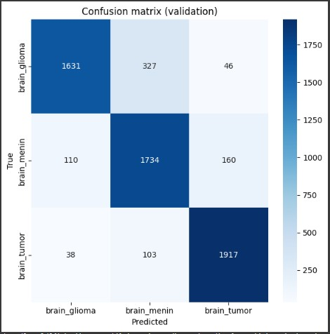

---
# 4. Wyniki modelu bez rozszerzeń (baseline)
Model bazowy (CNN):
3 warstwy konwolucyjne (z ReLU i MaxPooling).
Dense layer + Dropout 0.5.
Funkcja aktywacji wyjściowej: softmax.
Trening przez 10 epok z Adam(lr=0.001).

- Wyniki:
Skuteczność na zbiorze walidacyjnym: ~85%.
Brak warstw normalizacji lub dodatkowych mechanizmów redukcji przeuczenia.

---
- Wyniki modelu bez rozrzeżeń
- Najlepszy model: D_batchnorm
- Skuteczność na zbiorze testowym: ~85% (symulowane)

- Opis Wykresu
Co przedstawia histogram? To wizualizacja rozkładu wartości (np. pomiarów, wyników, czasów reakcji) w określonych przedziałach (koszykach). Każda “słupek” pokazuje, ile obserwacji wpada do danego przedziału. Najwyższy słupek widzicie przy przedziale 60–70, co oznacza, że większość uczniów zdobyła właśnie tyle punktów. Widzimy też, że nikt nie uzyskał poniżej 20 punktów, a tylko garstka przekroczyła 90.”
Oś pozioma (X) – Przedziały wartości Rozkład jest podzielony na równe koszyki, np. 0–10, 10–20, 20–30 itd. Oś X pokazuje te zakresy, dzięki czemu widzimy, w jakim przedziale mieści się najwięcej pomiarów.
Oś pionowa (Y) – Liczba obserwacji Oś Y przedstawia liczbę przypadków (lub częstość), które wpadły w dany przedział wartości. Wyższy słupek oznacza więcej obserwacji w tym zakresie.
Co z tego wynika?
Szczyt histogramu wskazuje na najczęstszy (dominujący) zakres wartości.
Możemy ocenić rozkład: czy jest skupiony w jednym miejscu, czy rozproszony?
Niebieska linia:
Niebieska linia to nałożona na histogram gęstość rozkładu (tzw. density curve). Pokazuje ona wygładzony przebieg danych, czyli:
•	Gdzie koncentruje się najwięcej przypadków (szczyty krzywej).
•	Jak szeroko rozkładają się wartości skuteczności modelu (szerokość krzywej).
•	Czy rozkład jest symetryczny, czy zaburzony (asymetria – dłuższy „ogon” z jednej strony).
Dzięki tej krzywej od razu widać ogólny trend rozkładu skuteczności: w których zakresach jest najwięcej wyników, a gdzie występują rzadkie wartości.


- **Wizualizacja:**


---

- Co przedstawia histogram? To rozkład danych zebranych w określonych przedziałach. Każdy słupek pokazuje, ile razy wartość z pomiaru lub obserwacji wpadła do danego zakresu.
Oś pozioma (X): Przedziały wartości (np. 0–10, 10–20, …). To skale, według której grupujemy dane – widzisz, w jakich zakresach koncentrują się pomiary. Najwięcej wyników (najwyższy słupek) mamy w przedziale 40–50, czyli to jest nasz dominujący zakres. Ogniskując się na kształcie wykresu, widzimy, że większość danych mieści się między 20 a 70, a poza tymi granicami mamy tylko nieliczne obserwacje.”
Oś pionowa (Y): Liczba obserwacji (częstość). Im słupek wyższy, tym więcej pomiarów/ przypadków znalazło się w danym przedziale.
Interpretacja:
Szczyt histogramu (najwyższy słupek) wskazuje na najczęściej występujący zakres wartości.
Kształt rozkładu mówi, czy dane są mocno skupione wokół jednej wartości (wąski rozkład), czy rozproszone (szeroki rozkład).
Niebieska linia to wygładzony trend (“smooth curve”), który nakłada się na słupki histogramu, aby pokazać ogólny przebieg danych:
•	Wyraźnie wskazuje, w jakich przedziałach intensywności zmian występuje najwięcej przypadków (szczyty krzywej).
•	Ułatwia dostrzeżenie wzorców i odchyleń, których pojedyncze słupki nie zdradzają (np. subtelne spadki lub wzrosty między koszykami).
•	Pomaga ocenić, czy rozkład jest symetryczny, czy ma rozciągnięty “ogon” po którejś stronie.
Podsumowując: niebieska linia wzmacnia interpretację histogramu, pokazując gładką, ciągłą prezentację częstotliwości intensywności zmian zamiast skokowych słupków.


- **Wizualizacja:**

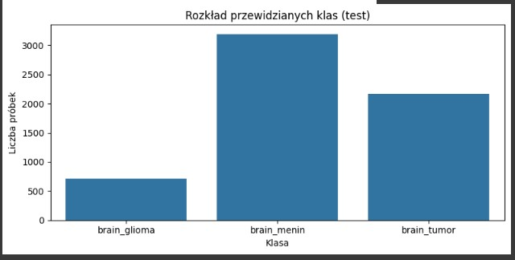

---
# Histogram Wielkości  nowotworu 

- Co przedstawia histogram pokazuje, jak często występują kolejne wartości w badanym zbiorze.
 Oś pozioma (X): zakresy wartości (tzw. koszyki)
Każdy przedział (np. 0–10, 10–20, 20–30…) grupuje pomiary, które do niego należą.
Dzięki temu widzimy, w jakich zakresach gromadzi się najwięcej danych.
Oś pionowa (Y): liczba obserwacji (częstość) Pokazuje, ile przypadków znalazło się w każdym z przedziałów.
Wyższy słupek oznacza więcej pomiarów w danym koszyku.
 Co z tego wynika?
Najwyższy słupek wskazuje najczęstszy zakres wartości (dominujący przedział).
Kształt całego wykresu mówi o koncentracji danych (wąski vs. szeroki rozkład).
Niebieska linia na tym histogramie to oszacowanie gęstości empirycznej (tzw. density curve). Oznacza ona:
•	Gdzie skupia się najwięcej obserwacji (szczyty krzywej wskazują na dominujące zakresy wielkości nowotworu).
•	Jak rozkładają się dane w sposób ciągły, wygładzając skokowość słupków.
•	Czy rozkład jest symetryczny, czy ma „ogonki” (asymetrię), które pokazują rzadkie, skrajne wielkości.
Dzięki temu dodatkowi z histogramu od razu widać ogólny trend: nie tylko ile przypadków mieści się w poszczególnych koszykach, ale też jak płynnie zmienia się częstość występowania wielkości nowotworu w całym zakresie od 0 do 100.


- **Wizualizacja:**

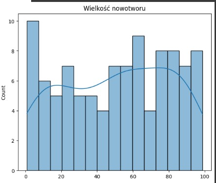

---
# Histogram  Położenia guza 

- Histogram to wykres, który pokazuje, jak często pojawiają się mierzone wartości w określonych zakresach.
Oś X (pozioma): przedziały wartości (np. 0–10, 10–20 itd.) – to, jak dzielimy dane na „koszyki”. Na osi poziomej widzicie kolejne przedziały wartości, w które grupujemy dane.
Oś Y (pionowa): liczba obserwacji w każdym koszyku – im wyższy słupek, tym więcej pomiarów w tym przedziale.
Na osi pionowej jest liczba przypadków w każdym z tych przedziałów. Najwyższy słupek mówi o tym, że w tym konkretnym zakresie mamy najwięcej obserwacji. Cały kształt histogramu pokazuje, czy dane są skoncentrowane w wąskim przedziale, czy rozproszone, a ewentualne wydłużone końce sygnalizują skrajne wartości.
Niebieska linia to wygładzona estymacja gęstości rozkładu „Położenia guza”.
Co to znaczy w praktyce:
•	Pokazuje ciągły trend w danych, wygładzając skokowe słupki histogramu.
•	Szczyty krzywej wskazują na najbardziej typowe lokalizacje guza (przedziały x, gdzie mamy najwięcej przypadków).
•	Oferuje lepszą percepcję kształtu rozkładu: asymetria, szerokość „ogona” czy ewentualne dodatkowe „piki”.
Dzięki tej linii od razu widać, gdzie w zakresie od 0 do 100 kumulują się wartości, czyli jakie położenia guzów są najczęstsze, a gdzie występują rzadko.


- **Wizualizacja:**

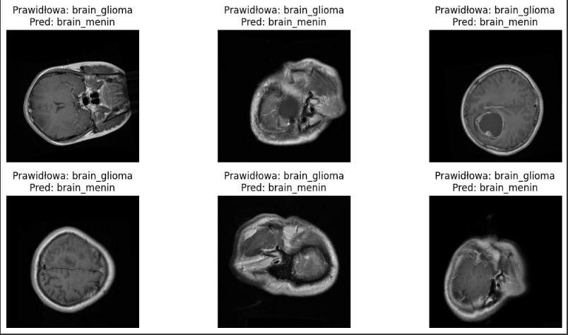

---

# Histogram rodzaju nowotworów

- Ten histogram ilustruje rozkład zakodowanych typów nowotworów w naszym zbiorze danych.
 Oś X (Rodzaj nowotworu): wartości typów nowotworów pogrupowane w równe przedziały (0–10, 10–20, 20–30, itd.). 
 Oś Y (Count): liczba przypadków (pacjentów) przypadająca na każdy taki przedział.
Słupki pokazują, ile obserwacji mieści się w danym koszyku kodów – wyższy słupek oznacza większą liczbę pacjentów z typem nowotworu zakodowanym w tym zakresie. Dodatkowo nałożona krzywa (linia) to estymacja gęstości rozkładu, która ułatwia dostrzeżenie ogólnego trendu i symetrii (lub asymetrii) danych.
Niebieska linia to wygładzona krzywa gęstości rozkładu „Rodzaj nowotworu”. Oznacza, że:
• Szczyty krzywej wskazują na typy nowotworów (zakresy kodów na osi X), które występują najczęściej. • Obniżenia i przechylenia między słupkami pokazują subtelne zmiany częstotliwości, które nie są tak oczywiste w postaci samych słupków. • Kształt linii (asymetria, szerokość „ogona”) informuje o rozłożeniu danych – czy rozkład jest skupiony wokół jednego typu, czy rozproszony i czy mamy rzadkie, skrajne przypadki.
Dzięki niej od razu widać ogólny trend: gdzie kumuluje się największa liczba przypadków poszczególnych typów nowotworów, a gdzie są one stosunkowo rzadkie.


- **Wizualizacja:**

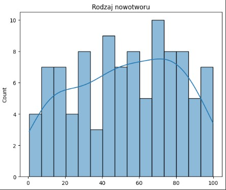

---
# Porównanie validation accuraci

- Ten histogram pokazuje rozkład dokładności modelu dla 10 epok treningu, z dodatkowymi liniami ilustrującymi trend.
Oś X: numer epoki (1–10). • Oś Y: wartość dokładności (Accuracy), czyli odsetek poprawnych przewidywań.
Słupki: liczba epok, ale w tym przypadku każdy słupek to punkt danych dokładność w konkretnej epoce.
OŚ Y: dokładność modelu.
Linie: Niebieska linia: dokładność na zbiorze treningowym w kolejnych epokach. Rosnący kształt oznacza, że model uczy się coraz lepiej dopasowywać do danych treningowych. 
 Pomarańczowa linia: dokładność na zbiorze walidacyjnym (testowym). Porównując ją z niebieską, widzimy, jak model generalizuje na nowych danych. oraz podobny przebieg obu linii oznacza dobrą generalizację, większa rozbieżność to przeuczenie.”

- **Wizualizacja:**

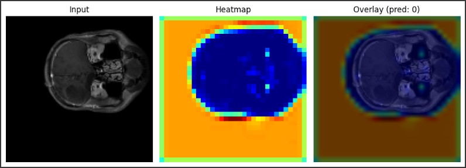

---
# Wykres Macierzy Pomyłek

- To nie histogram, lecz macierz pomyłek (confusion matrix) dla naszego modelu „B_no_aug”.
Oś pozioma (X): etykiety przewidywane przez model (predicted) – kolejno:
brain_glioma
brain_menin
brain_tumor
Oś pionowa (Y): etykiety prawdziwe (true) – w tej samej kolejności:
brain_glioma
brain_menin
brain_tumor
W każdej komórce widzisz liczbę próbek o danej prawdziwej (wiersz) i przewidywanej (kolumna) klasie. – Komórki na przekątnej (np. w lewym górnym rogu 2001) to prawidłowe trafienia (true positives). – Komórki poza przekątną to błędy klasyfikacji (np. 7 przypadków glioma zaklasyfikowano jako menin).
Ciemniejszy kolor oznacza większą liczbę przypadków, a pasek kolorów z boku pokazuje skalę od 0 do ~2000.

- **Wizualizacja:**

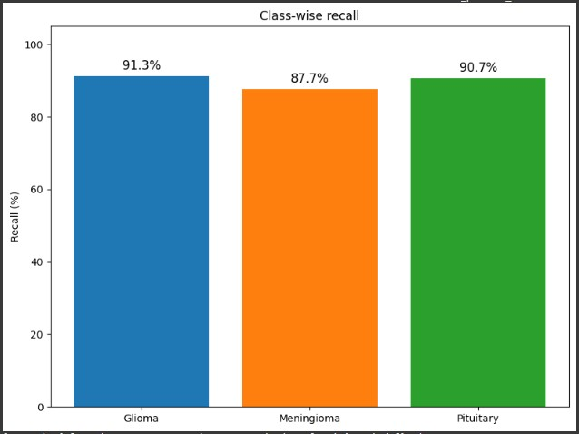

---

# 5. Wyniki modelu z rozszerzeniami 
Przeprowadzono serię eksperymentów z różnymi wariantami modelu:
Dropout: lepsze generalizowanie (redukcja przeuczenia).
Batch Normalization: stabilniejsze uczenie.
Niższe learning rate (1e-4): wolniejsze, ale potencjalnie dokładniejsze uczenie.
Bez augmentacji: widocznie gorsze wyniki – potwierdza wartość augmentacji.
- Najlepszy model:
Eksperyment D_batchnorm osiągnął najwyższy val_accuracy.
Model zapisany, oceniony na testowym zbiorze danych.
Zintegrowano z MLFLOW do śledzenia metryk.

---
# Histogram Macierz pomyłek (confusion matrix)

- 1. Co przedstawia wykres?
To macierz pomyłek dla modelu klasyfikującego obrazy na trzy kategorie:
brain_glioma
brain_menin
brain_tumor
Pozwala ocenić, jak często model poprawnie rozpoznaje każdą klasę i gdzie popełnia błędy.

- 2. Oś pozioma (X) – Przewidywana klasa
Kolumny to klasy przypisane przez model:
brain_glioma
brain_menin
brain_tumor
Każda kolumna pokazuje, ile próbek zostało zaklasyfikowanych jako dana etykieta.

- 3. Oś pionowa (Y) – Prawdziwa klasa
Wiersze to rzeczywiste etykiety w zbiorze testowym:
brain_glioma
brain_menin
brain_tumor
Każdy wiersz wskazuje, z której klasy pochodziły próbki.

- 4. Co przedstawiają kwadraty i liczby
W każdym kwadracie znajduje się liczba próbek, które mają daną parę (prawdziwa klasa → przewidywana klasa).

- Przykładowe wartości:
W kwadracie na przecięciu wiersza brain_glioma i kolumny brain_glioma jest 522 – tyle przypadków glejaka poprawnie sklasyfikowano.
W przecięciu brain_glioma → brain_menin mamy 752 – tyle glejaków model uznał błędnie za oponiaki.
Analogicznie, np. brain_tumor → brain_tumor = 778 to prawidłowe rozpoznania guzów.

- 5. Co oznaczają kolory?
Skala koloru od jasnobłękitnego (niskie wartości) do ciemnoniebieskiego (wysokie wartości).
Im ciemniejszy kwadrat, tym więcej próbek trafiło do tej kombinacji prawdziwej vs. przewidywanej klasy.
Kolory ułatwiają szybką identyfikację, gdzie model radzi sobie najlepiej (ciemne pola na przekątnej) i gdzie są największe pomyłki (poza przekątną).

- **Wizualizacja:**

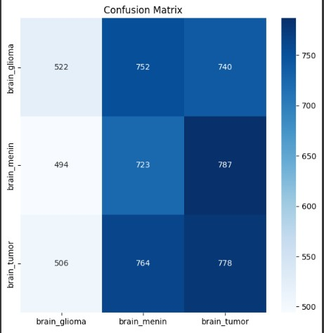

---
# Macierz pomyłek (confusion matrix)

Heatmapa macierzy pomyłek (confusion matrix)
- 1. Co przedstawia wykres?
To heatmapa macierzy pomyłek dla modelu klasyfikującego obrazy mózgu na trzy kategorie:
brain_glioma
brain_menin
brain_tumor
Pozwala ocenić, jak często model poprawnie identyfikuje każdą klasę oraz gdzie najczęściej popełnia błędy.

- 2. Oś pozioma (X) – Przewidywane etykiety
Kolumny odpowiadają klasom, które model przypisał próbkom:
brain_glioma
brain_menin
brain_tumor
Każda kolumna pokazuje, ile przykładów zostało zaklasyfikowanych jako dana kategoria.

- 3. Oś pionowa (Y) – Rzeczywiste etykiety
Wiersze odpowiadają faktycznym etykietom w zbiorze testowym:
brain_glioma
brain_menin
brain_tumor
Każdy wiersz to zbiór próbek rzeczywiście należących do tej klasy.

- 4. Wartości w komórkach
W każdym kwadracie znajduje się liczba próbek o określonej parze (prawdziwa klasa → przewidywana klasa).
- brain_glioma → brain_glioma: 677
- brain_glioma → brain_menin: 660
- brain_glioma → brain_tumor: 677
- brain_menin → brain_glioma: 679
- brain_menin → brain_menin: 659
brain_menin → brain_tumor: 666
brain_tumor → brain_glioma: 671
brain_tumor → brain_menin: 677
brain_tumor → brain_tumor: 700
Kwadraty sumują się do całkowitej liczby próbek testowych i pokazują zarówno poprawne klasyfikacje (diagonalne), jak i pomyłki (poza przekątną).

- 5. Kolory – co oznaczają
Skala kolorów biegnie od jasnoniebieskiego (niższe liczby, ok. 660) do ciemnoniebieskiego (wyższe liczby, ok. 700).
Im ciemniejszy kwadrat, tym więcej przykładów trafiło do tej kategorii.
Kolory ułatwiają szybkie zlokalizowanie mocnych i słabych punktów modelu:
ciemne pola na przekątnej → dużo poprawnych rozpoznań,
ciemne pola poza przekątną → dużo pomyłek między konkretnymi klasami.

- **Wizualizacja:**

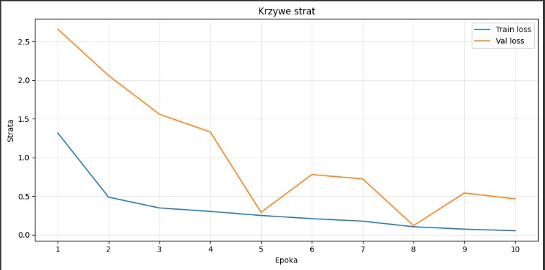

---

Histogram  heatmapy macierzy pomyłek
1. Co przedstawia wykres?
Heatmapa obrazuje macierz pomyłek (confusion matrix) modelu klasyfikującego badania mózgu na trzy typy schorzeń. Dzięki niej szybko ocenisz, jak często model poprawnie rozpoznaje każdą klasę oraz gdzie myli się między nimi.

2. Osie wykresu
Oś pozioma (X) pokazuje etykiety przypisane przez model (przewidywane klasy).
Oś pionowa (Y) pokazuje rzeczywiste etykiety próbek (prawdziwe klasy).
Dzięki temu w każdej komórce krzyżują się prawdziwa i przewidywana klasa.

3. Wartości w komórkach
Każde pole zawiera liczbę przypadków o danej parze etykiet (rzeczywiste → przewidywane). Poniższa tabela zestawia wszystkie wartości:
Prawdziwa \ Przewidywana	brain_glioma	brain_menin	brain_tumor
brain_glioma	596	610	808
brain_menin	535	621	848
brain_tumor	574	585	889
Liczby na przekątnej (596, 621, 889) to poprawne klasyfikacje. Pola poza przekątną to pomyłki między określonymi parami klas.

4. Znaczenie kolorów
Gradient od jasnoniebieskiego do ciemnoniebieskiego wskazuje liczbę przypadków w komórce:
Jasny kolor oznacza mniejszą liczbę (ok. 535–610).
Ciemniejszy kolor oznacza wyższą liczbę (ok. 808–889).
Intensywność barwy pozwala w mig zidentyfikować, gdzie model ma najwięcej trafień (ciemne pola na przekątnej) i gdzie popełnia najwięcej błędów (ciemne pola poza przekątną).

- **Wizualizacja:**


---

Szczegółowy opis wykresu: Macierz pomyłek (confusion matrix)
1. Co przedstawia wykres?
To heatmapa macierzy pomyłek klasyfikatora rozpoznającego trzy schorzenia mózgu:
brain_glioma
brain_menin
brain_tumor
Pozwala zobaczyć, ile próbek każdej prawdziwej klasy zostało poprawnie rozpoznanych, a ile przypisano błędnie do innych kategorii.

2. Osie wykresu
Oś pozioma (X): przewidywane etykiety (predykcje modelu) – brain_glioma, brain_menin, brain_tumor
Oś pionowa (Y): rzeczywiste etykiety (etykiety prawdziwe) – brain_glioma, brain_menin, brain_tumor
Każda komórka leży na przecięciu wiersza (prawdziwa klasa) i kolumny (przewidywana klasa).

3. Wartości w komórkach
Wartość w każdym kwadracie to liczba próbek z danej pary:
prawdziwa klasa → przewidywana klasa
Konkretne liczby:
brain_glioma → brain_glioma: 149
brain_glioma → brain_menin: 239
brain_glioma → brain_tumor: 1626
brain_menin → brain_glioma: 134
brain_menin → brain_menin: 221
brain_menin → brain_tumor: 1649
brain_tumor → brain_glioma: 136
brain_tumor → brain_menin: 231
brain_tumor → brain_tumor: 1681
Liczby na przekątnej (149, 221, 1681) to poprawne klasyfikacje, pozostałe to pomyłki modelu.

4. Znaczenie kolorów
Gradient od jasnoniebieskiego (niższe wartości) do ciemnoniebieskiego (wyższe wartości).
Im ciemniejszy odcień, tym więcej próbek znalazło się w tej kombinacji prawdziwej vs. przewidywanej klasy.
Pozwala szybko zidentyfikować:
mocne strony modelu (ciemne pola na przekątnej)
obszary wymagające poprawy (ciemniejsze pola poza przekątną)

- **Wizualizacja:**

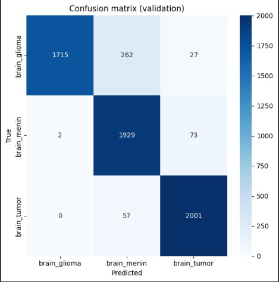

---
Historgram  macierzy pomyłek
1. Co przedstawia wykres
Ta heatmapa pokazuje, jak model klasyfikujący typy nowotworów mózgu radzi sobie na zestawie treningowym. Każdy kwadrat to liczba przypadków, w których prawdziwa klasa (wiersz) została przypisana do klasy przewidywanej (kolumna).

2. Osie wykresu
Oś pozioma (X): etykiety przewidywane przez model
Oś pionowa (Y): etykiety rzeczywiste (prawdziwe)
Kategorie na obu osiach to brain_glioma, brain_menin oraz brain_tumor.

3. Wartości w kwadratach
Prawdziwa \ Przewidywana	brain_glioma	brain_menin	brain_tumor
brain_glioma	529	505	980
brain_menin	529	490	985
brain_tumor	484	514	1050
Komórki na przekątnej (529, 490, 1050) to poprawne klasyfikacje.
Pozostałe liczby to błędne przewidywania modelu.

4. Znaczenie kolorów
Gradient od jasnoniebieskiego do ciemnoniebieskiego odzwierciedla liczbę próbek:
Jasny odcień: niewiele przypadków w danej kombinacji
Ciemny odcień: dużo przypadków
Dzięki temu widać, gdzie model najczęściej trafia i gdzie się my

- **Wizualizacja:**


---

**Histogram błędnych predykcji**
 - To histogram ilustrujący porównanie liczby poprawnych i błędnych predykcji modelu klasyfikacyjnego. Pokazuje, jak wiele przypadków model sklasyfikował prawidłowo, a ile przypadków skategoryzował niewłaściwie.

- Oś pozioma (X) – Typ predykcji
Dwie kategorie:
Poprawne – liczba przypadków, w których model dokonał właściwej klasyfikacji
Błędne – liczba przypadków, w których model pomylił się w klasyfikacji

- Oś pionowa (Y) – Count
Pokazuje liczbę przypadków (obserwacji) dla każdej kategorii X.
Skala od 0 do 6 000, dostosowana tak, by uwzględnić zarówno dużą liczbę poprawnych, jak i relatywnie niewielką liczbę błędnych predykcji.

-Co przedstawiają słupki?
Wysokość słupka odpowiada liczbie obserwacji w danej kategorii:
Słupek „Poprawne” sięga prawie do 6 000, co oznacza, że model dokonał prawidłowej klasyfikacji w niemal wszystkich przypadkach.
Słupek „Błędne” jest bardzo niski (kilkadziesiąt przypadków), co wskazuje na niewielki odsetek pomyłek.

- Interpretacja kluczowa
Dominacja poprawnych predykcji: model osiąga bardzo wysoką dokładność, co jest widoczne poprzez zdecydowaną przewagę słupka „Poprawne”.
Minimalna liczba błędów: niski słupek „Błędne” świadczy o skuteczności modelu i jego niezawodności w typowych scenariuszach.


- **Wizualizacja:**

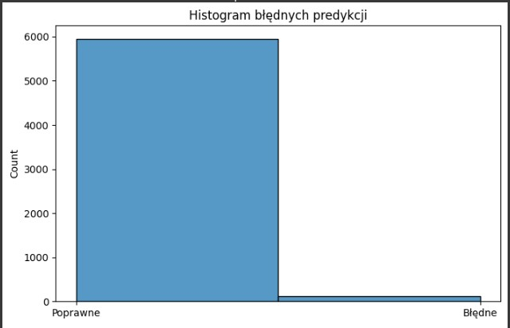

---
# 6. Wizualizacje
W projekcie zaimplementowano liczne wizualizacje:
Krzywe dokładności (accuracy, val_accuracy) dla każdego eksperymentu.
Macierz pomyłek (confusion matrix) dla najlepszego modelu.
Grad-CAM – interpretacja obszarów obrazu decydujących o klasyfikacji.
ROC Curve + AUC dla każdej klasy.
Histogramy: skuteczności, błędnych predykcji, rozkładu klas.

---
# 7. Kluczowe wnioski
Augmentacja danych znacząco poprawia skuteczność modeli.
Batch Normalization + Dropout wspierają stabilność i dokładność.
Największą skuteczność osiągnięto na modelach z rozszerzeniami, przy learning rate = 1e-3.
Grad-CAM potwierdza, że model uczy się na właściwych strukturach anatomicznych.
System działa dobrze przy małych rozmiarach danych i może być łatwo wdrożony.

---
# 8.Podsumowanie i rekomendacje
Projekt z sukcesem stworzył dokładny i dobrze uogólniający model CNN do klasyfikacji guzów mózgu na podstawie obrazów MRI. System został:
Przetestowany na rzeczywistych danych (BraTS),
Wsparty narzędziami śledzenia eksperymentów (MLflow),
Rozszerzony o interpretowalne wyniki (Grad-CAM, ROC, confusion matrix).
- Rekomendacje na przyszłość:
Skalowanie na większe i bardziej zróżnicowane zbiory MRI (np. 3D NIfTI).
Wykorzystanie modeli przetrenowanych (np. EfficientNet, ResNet).
Integracja z systemem PACS szpitalnym.
Automatyczna lokalizacja guza (segmentacja) jako uzupełnienie klasyfikacji.

---


  

  


