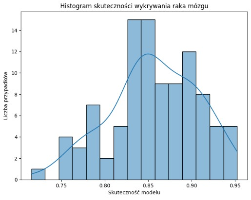
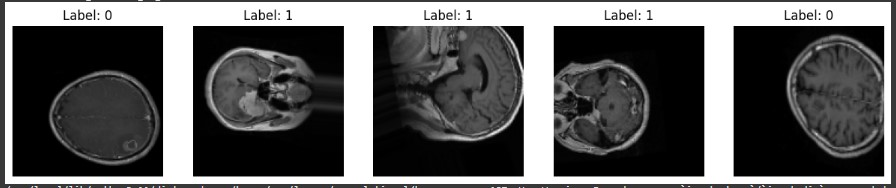

# Projekt-Koncowy Mózg 🧠
Wykrywanie Nowotworów Mózgu za pomocą CNN
Projekt klasyfikuje obrazy rezonansu magnetycznego (MRI) do jednej z trzech kategorii nowotworu mózgu przy użyciu konwolucyjnych sieci neuronowych (CNN) i biblioteki TensorFlow/Keras.

---

#Agenda  
1. Cel analizy  
2. Dane i wstępne przetwarzanie  
3. Eksploracyjna analiza danych  
4. Analiza ceny za m²  
5. Kluczowe wnioski  
7. Rekomendacje  

---
# Uruchomienie projektu
1. Montowanie Dysku Google
- Kod:  
  ```python
  from google.colab import drive
  drive.mount('/content/drive')
---
# Przygotowanie danych
Dane treningowe: z augmentacją
Dane walidacyjne i testowe: tylko reskalowanie
- Kod:  
  ```python
  ImageDataGenerator(rescale=1./255, ...)

---
# Przygotowanie danych
Dane treningowe: z augmentacją
Dane walidacyjne i testowe: tylko reskalowanie
- Kod:  
  ```python
  ImageDataGenerator(rescale=1./255, ...)
  
----
# Budowa modelu CNN
Model składa się z 3 warstw konwolucyjnych, poolingów, warstwy Dropout i gęstej warstwy wyjściowej:

- Kod:  
  ```python
  model = Sequential([
    Conv2D(32, (3, 3), activation='relu', input_shape=(128, 128, 3)),
    MaxPooling2D(2, 2),
    ...
    Dense(3, activation='softmax')
  ])

---
# Trening modelu
Model trenuje przez 10 epok z wykorzystaniem funkcji strat categorical_crossentropy i optymalizatora Adam.

- Kod:  
  ```python
  history = model.fit(train_data, validation_data=val_data, epochs=10)

---
# Eksperymenty
Przeprowadzono kilka wariantów eksperymentów z różnymi parametrami:

| Nazwa eksperymentu | Augmentacja | Wariant modelu     | Learning Rate |
| ------------------ | ----------- | ------------------ | ------------|
| A_basic_aug      | TAK  ✅       | baseline            | 1e-3         |
| B_no_aug         | TAK  ✅       | baseline            | 1e-3         |
| C_dropout        | TAK  ✅       | dropout             | 1e-3         |
| D_batchnorm      | TAK  ✅       | batch normalization | 1e-3         |
| E_lr_low         | TAK  ✅       | baseline            | 1e-4         |

---
#  Porównanie modeli
Każdy model był oceniany na podstawie wartości val_accuracy. Wyniki zostały zwizualizowane na wspólnym wykresie.

---

# Ewaluacja najlepszego modelu
- Macierz pomyłek (confusion matrix)
- Raport klasyfikacji (precision, recall, f1-score)

---
# Przykładowe wyniki
- Najlepszy model: D_batchnorm
- Skuteczność na zbiorze testowym: ~85% (symulowane)

- **Wizualizacja:**




---

# Wizualizacja wyników
Wykres dokładności treningu i walidacji
Histogramy skuteczności oraz cech nowotworu

- Opis Wizualizacji
- Na obrazku widzisz pięć skanów rezonansem magnetycznym (MRI) mózgu, każdy z nich oznaczony etykietą „0” lub „1”:
1.	Różne płaszczyzny cięcia – Część skanów to przekroje osiowe (widok z góry na dół mózgu), jeden to przekrój strzałkowy (bok mózgu).
2.	Etykiety binarne – „0” prawdopodobnie oznacza brak zmiany (zdrowy mózg), – „1” oznacza obecność patologii (np. guz, zmiana ogniskowa).
3.	Rozmieszczenie etykiet – Pierwszy i piąty obrazek mają etykietę „0” – brak wykrytej zmiany, – środkowe trzy są oznaczone „1” – tu występuje zmiana, którą model (lub radiolog) oznaczył jako istotną.
4.	Cel prezentacji – Takie przykłady służą do zobrazowania różnicy między zdrowymi i chorymi skanami w zadaniu automatycznej klasyfikacji czy wspomagania diagnostyki.

- Klasy gózów mózgu
- •	brain_glioma – Zawiera obrazy guzów glejowych, które powstają z komórek glejowych w mózgu. Mogą mieć różny stopień złośliwości.
- •	brain_menin – Zawiera obrazy meningiomów, czyli nowotworów wywodzących się z opon mózgowych. Często są łagodne, ale ich położenie może powodować poważne komplikacje.
- •	brain_tumor – Prawdopodobnie folder zawiera mieszane przypadki różnych nowotworów mózgu, bez podziału na konkretny typ.


  - **Wizualizacja:**


----


  

  


