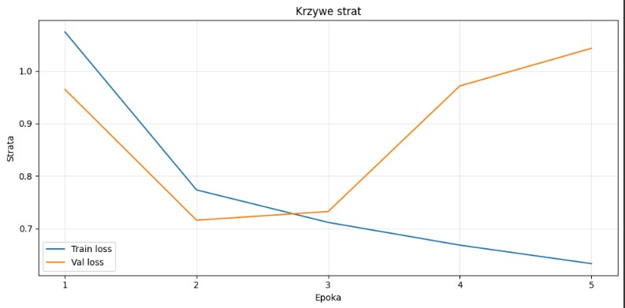
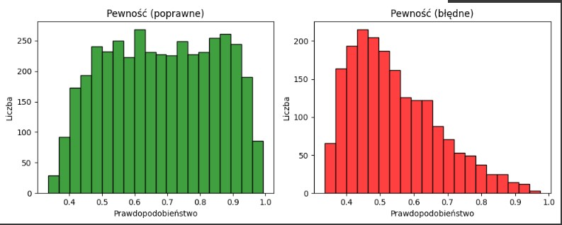

---
# Projekt-Koncowy 🧠
---

---
# Agenda  
1. Cel stworzenia modelu
2. Zastosowane techniki
3. Dane i klasy guzów mózgu
4. Wizualizacja guzów mózgu 
5. Wyniki modelu (Optuna + CNN)
6. Kluczowe wnioski
7. Podsumowanie i rekomendacje

---
# 1. Cel stworzenia modelu
Celem projektu było opracowanie modelu głębokiego uczenia (Convolutional Neural Network, CNN), który automatycznie klasyfikuje obrazy MRI mózgu na trzy typy guzów: 
- glioma
- meningioma
- guzy przysadki

- Model ma wspomóc diagnostykę radiologiczną poprzez: przyspieszenie procesu analizy obrazów,zwiększenie dokładności klasyfikacji, dostarczenie interpretowalnych wyników (np. macierz pomyłek, F1 per klasa).
Dodatkowo, projekt pokazuje jak można wykorzystać Optunę do automatycznej optymalizacji hiperparametrów, co zwiększa wiarygodność i powtarzalność wyników.
---
# 2. Zastosowane techniki
- Convolutional Neural Network (CNN) – standard w analizie obrazów medycznych.
- Optuna – automatyczna optymalizacja hiperparametrów (learning rate, optimizer, liczba filtrów).
- Augmentacja danych – rotacje, przesunięcia, zmiany jasności → poprawa uogólniania.
- Normalizacja – stabilizuje uczenie.
- BatchNormalization – przyspiesza zbieżność i stabilizuje gradienty.
- Dropout – redukuje ryzyko przeuczenia.
- EarlyStopping + ReduceLROnPlateau – zatrzymują trening w odpowiednim momencie i dostosowują learning rate.
- MLflow – śledzenie eksperymentów i logowanie wyników.
- tf.data.Dataset – wydajne ładowanie i przetwarzanie danych.
---
# 3. Dane i klasy guzów mózgu
---
# Przykłady obrazów używanych przez model 
- Na tym zdjęciu widzimy przykładowe obrazy MRI różnych rodzajów guzów mózgu. Meningioma to guzy powierzchniowe,
  dobrze odgraniczone i przylegające do opon mózgowych. Glioma to guzy wewnętrzne, o nieregularnym kształcie,
  które trudniej odróżnić od zdrowej tkanki. Ostatni przykład pokazuje guz mózgu w ujęciu ogólnym.
  Dzięki temu zestawieniu możemy zobaczyć, jak różnią się one wyglądem i lokalizacją.

- **Wizualizacja:**

---
# 4. Wizualizacja guzów mózgu 
---
- # Wizualizacja zdrowy mózg i chory mózg
- Opis zdjęcia – porównanie obrazów MRI mózgu: Na ilustracji widzimy dwa obrazy MRI mózgu zestawione obok siebie w celu porównania.
Po lewej stronie znajduje się obraz oznaczony jako „Normal” – przedstawia zdrowy mózg, w którym struktury są symetryczne i nie widać żadnych nieprawidłowości ani zmian chorobowych.
Po prawej stronie znajduje się obraz oznaczony jako „Malignant” – przedstawia mózg z widoczną zmianą nowotworową. Jasny, nieregularny obszar wskazuje na obecność guza, który zaburza prawidłową strukturę tkanki mózgowej.

- Różnice między wizualizacjami:
W obrazie normalnym tkanki są równomierne, bez wyraźnych ognisk czy asymetrii.
W obrazie złośliwym widoczny jest jasny, nieregularny obszar, który odróżnia się od reszty tkanki – to właśnie zmiana nowotworowa.
Kontrast między tymi dwoma obrazami pozwala łatwo zauważyć, jak guz wpływa na strukturę mózgu i jak bardzo różni się od obrazu zdrowego.

- **Wizualizacja:**

---
- # Wizualizacja klasyfikacja guzów mózgu
- Opis zdjęcia  widzimy przykładowe obrazy MRI trzech rodzajów guzów mózgu. Meningioma to guzy powierzchniowe,
  glioma rozwija się wewnątrz tkanki mózgowej i ma nieregularny kształt, a pituitary to guzy przysadki,
  zlokalizowane w centralnej części mózgu. To zestawienie pokazuje, jak różnią się one wyglądem i lokalizacją.
- Różnice między wizualizacjami:
  Meningioma – guzy bardziej powierzchowne, dobrze widoczne przy krawędzi mózgu.
  Glioma – guzy wewnętrzne, o nieregularnych granicach, trudniejsze do jednoznacznego odróżnienia od zdrowej tkanki.
  Pituitary – guzy zlokalizowane centralnie, w okolicy przysadki, różniące się położeniem od pozostałych typów.

- **Wizualizacja:**

---
# 4. Wyniki modelu (Optuna + CNN)
---

# Wykres dokładność modelu 
- Na tym wykresie widzimy, jak zmieniała się wartość błędu modelu w kolejnych epokach.
  Oś pozioma to epoki, a oś pionowa to strata, czyli miara błędu.
  Niebieska linia pokazuje wyniki na danych treningowych,a pomarańczowa – na danych walidacyjnych.
  Widzimy, że początkowo obie wartości spadają, ale od 4.epoki walidacja zaczyna rosnąć, co oznacza, że model zaczyna się przeuczać.

- **Wizualizacja:**

---
# Wykres krzywe strat 

- Na tym wykresie widzimy, jak zmieniała się dokładność modelu w kolejnych epokach.
  Oś pozioma to epoki, a oś pionowa to dokładność, czyli procent poprawnych klasyfikacji.
  Niebieska linia pokazuje wyniki na danych treningowych, a pomarańczowa – na danych walidacyjnych. Widzimy,
  że model coraz lepiej uczy się na danych treningowych,
  ale od 3. epoki dokładność walidacyjna spada, co oznacza, że zaczyna się przeuczać.”

- **Wizualizacja:**

---
# Wykres heatmap (validation)
- Na tej heatmapie widzimy macierz pomyłek, która pokazuje, jak model klasyfikuje obrazy.
  Oś pozioma to przewidywania modelu, a oś pionowa to rzeczywiste etykiety. Każdy kwadrat przedstawia liczbę przypadków – im ciemniejszy kolor, tym więcej przykładów.
  Najważniejsze są wartości na przekątnej, bo oznaczają poprawne klasyfikacje. Widzimy, że model dobrze rozpoznaje większość przypadków,
  ale zdarzają się pomyłki, szczególnie przy rozróżnianiu glioma i meningioma.

- **Wizualizacja:**

---
# Heatmapa confiusion matrix  (test)
- Na tej heatmapie widzimy macierz pomyłek, która pokazuje, jak model klasyfikuje obrazy.
  Oś pozioma to przewidywania modelu, a oś pionowa to rzeczywiste etykiety. Każdy kwadrat
  przedstawia liczbę przypadków – im ciemniejszy kolor, tym więcej przykładów.
  Najważniejsze są wartości na przekątnej, bo oznaczają poprawne klasyfikacje. Widzimy,
  że model dobrze rozpoznaje większość przypadków, ale ma trudności w odróżnianiu meningioma od pozostałych klas.

- **Wizualizacja:**

---
# Wykres rozkład przewidzianych klas (test)
- Na tym histogramie widzimy, jak model rozłożył swoje przewidywania pomiędzy trzy klasy guzów mózgu.
Oś pozioma przedstawia klasy, a oś pionowa liczbę próbek. Każdy słupek pokazuje, ile przypadków model przypisał do danej klasy
najwięcej do glioma, mniej do tumor, a najmniej do meningioma. Dzięki temu możemy zobaczyć,
czy model równomiernie rozpoznaje wszystkie klasy, czy też ma tendencję do częstszego wybierania jednej z nich.”

- **Wizualizacja:**

---
# Histogram pewności poprawnych vs błędnych predykcji
- Na tym slajdzie widzimy dwa histogramy pokazujące, jak pewny był model przy swoich przewidywaniach.
  Oś pozioma to prawdopodobieństwo, a oś pionowa liczba przypadków. Zielony wykres pokazuje poprawne klasyfikacje
  widać, że model był wtedy zazwyczaj bardziej pewny. Czerwony wykres pokazuje błędne klasyfikacje
  tu wartości są niższe, co oznacza, że model częściej się mylił, gdy nie był do końca pewny swojego wyniku.

- **Wizualizacja:**

---
# Heatmapa macierz pomyłek 
- Na tej heatmapie widzimy macierz pomyłek, która pokazuje, jak model klasyfikuje obrazy.
  Oś pozioma to przewidywania modelu, a oś pionowato rzeczywiste etykiety.
  Każdy kwadrat przedstawia liczbę przypadków – im ciemniejszy kolor, tym więcej przykładów. Najważniejsze są wartości na przekątnej,bo oznaczają poprawne klasyfikacje.
  Widzimy, że model dobrze rozpoznaje większość przypadków, ale zdarzają się pomyłki, szczególnie przy rozróżnianiu glioma i meningioma.

- **Wizualizacja:**

---
# Wyniki modelu Grad-Cam

# Metryka klasyfikacji modelu Grad-Cam
- Na tym zdjęciu  widzimy trzy sposoby przedstawienia tego samego obrazu MRI.
Po lewej mamy oryginalny skan, w środku mapa cieplna pokazująca,które obszary były najważniejsze dla modelu, 
a po prawej nałożenie obu obrazów.Dzięki temu możemy zobaczyć, gdzie model faktycznie skupia swoją uwagę podczas klasyfikacji.

- Interpretacja wyników modelu metodą Grad-Cam:
  Lewy obraz pokazuje dane wejściowe, czyli to, co widzi lekarz.
  Środkowy obraz pokazuje dane „wewnętrzne” modelu – czyli jego uwagę i obszary, które uznał za kluczowe.
  Prawy obraz łączy oba widoki, co pozwala łatwo porównać, czy model zwraca uwagę na te same fragmenty, które byłyby istotne z punktu widzenia diagnostyki medycznej.

- **Wizualizacja:**

---

# Wykres Skuteczności wykrywania typów guzów mózgu
- Na wykresie przedstawiono czułość (sensitivity) modelu w rozpoznawaniu trzech rodzajów guzów mózgu: Glioma, Meningioma oraz Pituitary.
  Każdy słupek pokazuje, jak dobrze model rozpoznaje dany typ – najlepiej radzi sobie z glejakami (91,3%),
  nieco słabiej z oponiakami (87,7%), a guzy przysadki wykrywa z czułością 90,7%.

- 🟦 Słupek niebieski (Glioma) – pokazuje, że model osiągnął 91,3% czułości w wykrywaniu glejaków. 
- 🟧 Słupek pomarańczowy (Meningioma) – wskazuje na 87,7% czułości w rozpoznawaniu oponiaków. 
- 🟩 Słupek zielony (Pituitary) – przedstawia 90,7% czułości w wykrywaniu guzów przysadki.

- Interpretacja wynikuów histogramu skuteczności wykrywania typów guzów mózgu:
  Wszystkie trzy wartości są wysokie, co oznacza, że model skutecznie rozpoznaje różne typy guzów mózgu.
  Najlepiej rozpoznawane są glejaki (Glioma), a najtrudniejsze do wykrycia okazały się oponiaki (Meningioma), choć różnice są stosunkowo niewielkie.
  Taki wykres pozwala szybko porównać, dla których typów guzów model działa najpewniej, a gdzie mogą być potrzebne dalsze usprawnienia

- **Wizualizacja:**

---
# Wykres Skuteczność klasyfikacji guzów mózgu
- Na tym histogramie widzimy skuteczność modelu w wykrywaniu trzech typów guzów mózgu. 
Oś pozioma przedstawia rodzaje guzów, a oś pionowa czułość w procentach. 
Każdy słupek pokazuje, jak dobrze model rozpoznaje dany typ – najlepiej radzi sobie z glejakami (91,3%), 
nieco słabiej z oponiakami (87,7%), a guzy przysadki wykrywa z czułością 90,7%.

- 🟦 Słupek niebieski (Glioma) – pokazuje, że model osiągnął 91,3% czułości w wykrywaniu glejaków. 
- 🟧 Słupek pomarańczowy (Meningioma) – wskazuje na 87,7% czułości w rozpoznawaniu oponiaków. 
- 🟩 Słupek zielony (Pituitary) – przedstawia 90,7% czułości w wykrywaniu guzów przysadki.

- Interpretacja wyników histogramu kuteczność klasyfikacji guzów mózgu:
Wszystkie trzy wartości są wysokie, co oznacza, że model skutecznie rozpoznaje różne typy guzów mózgu.
Najlepiej rozpoznawane są glejaki (Glioma), a najtrudniejsze do wykrycia okazały się oponiaki (Meningioma), choć różnice są stosunkowo niewielkie.
Taki wykres pozwala szybko porównać, dla których typów guzów model działa najpewniej, a gdzie mogą być potrzebne dalsze usprawnienia.

- **Wizualizacja:**

---
# Wyniki zoptymalizowanego modelu mózg
---
# Histogram Kszywe strat
- Na tym wykresie widzimy, jak zmieniała się wartość błędu modelu w kolejnych epokach. 
Oś pozioma to epoki, a oś pionowa to strata, czyli miara błędu. Niebieska linia pokazuje wyniki na danych treningowych, 
a pomarańczowa – na danych walidacyjnych. Widzimy, że model uczy się coraz lepiej na danych treningowych, 
ale na walidacyjnych pojawiają się wahania, co może oznaczać przeuczenie.

🔵 Niebieska linia (Train loss) – pokazuje, jak zmieniała się strata na zbiorze treningowym. 
Widać, że systematycznie maleje, co oznacza, że model coraz lepiej uczy się danych, na których był trenowany. 
🟠 Pomarańczowa linia (Val loss) – przedstawia stratę na zbiorze walidacyjnym, czyli na danych, których model wcześniej nie widział. 
Linia ta również spada, ale jest bardziej niestabilna i w niektórych momentach rośnie, co może sugerować przeuczenie (overfitting) lub wahania jakości na danych testowych.

- Interpretacja wyników:
Początkowo obie krzywe spadają, co oznacza, że model poprawia swoje działanie.
W dalszych epokach różnica między stratą treningową a walidacyjną zaczyna się powiększać – model bardzo dobrze dopasowuje się do danych treningowych, 
ale nie zawsze przekłada się to na lepsze wyniki na danych walidacyjnych.
To typowy sygnał, że model może wymagać regularyzacji lub wcześniejszego zatrzymania treningu, aby uniknąć przeuczenia.

- **Wizualizacja:**

---
# Histogram dokładność modelu 

- **Wizualizacja:**

---
# 5. Kluczowe wnioski
---
# Kluczowe wnioski
- Augmentacja danych znacząco poprawia skuteczność.
- BatchNormalization + Dropout → stabilność i dokładność.
- Optuna pozwoliła dobrać optymalne hiperparametry (najlepszy wynik przy learning rate ≈ 1e-3).
- F1-macro i confusion matrix pokazują, że model dobrze radzi sobie z wszystkimi klasami, choć najtrudniejsze są przypadki guzów przysadki.
- System działa stabilnie nawet przy ograniczonym zbiorze danych.

---
# 6. Podsumowanie i rekomendacje
---
# Podsumowanie i rekomendacje
- Projekt z sukcesem stworzył dokładny i dobrze uogólniający model CNN do klasyfikacji guzów mózgu na podstawie obrazów MRI. System został:
przetestowany na rzeczywistych danych (BraTS),
wsparty narzędziami śledzenia eksperymentów (MLflow),
rozszerzony o interpretowalne wyniki (confusion matrix, F1 per klasa, histogramy).
- Rekomendacje na przyszłość:
Skalowanie na większe i bardziej zróżnicowane zbiory MRI (np. 3D NIfTI).
Wykorzystanie modeli przetrenowanych (EfficientNet, ResNet).
Integracja z systemem PACS szpitalnym.
Rozszerzenie o segmentację (lokalizacja guza).
---

  

  

