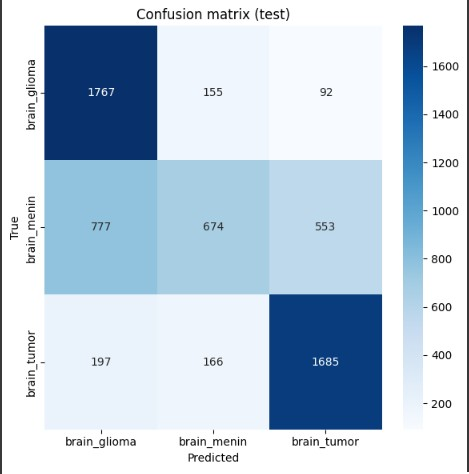

# Projekt-Koncowy Mózg 🧠
Wykrywanie Nowotworów Mózgu za pomocą CNN
Projekt klasyfikuje obrazy rezonansu magnetycznego (MRI) do jednej z trzech kategorii nowotworu mózgu przy użyciu konwolucyjnych sieci neuronowych (CNN) i biblioteki TensorFlow/Keras.

---

# Agenda  
1. Cel stworzenia modelu   
2. Dane i wstępne przetwarzanie  
3. Eksploracyjna analiza danych
4. Wyniki modelu
5. Wizualizacje  
6. Kluczowe wnioski  
7. Rekomendacje  

---
# Uruchomienie projektu
1. Montowanie Dysku Google
- Kod:  
  ```python
  from google.colab import drive
  drive.mount('/content/drive')
---
# Przygotowanie danych
Dane treningowe: z augmentacją
Dane walidacyjne i testowe: tylko reskalowanie
- Kod:  
  ```python
  ImageDataGenerator(rescale=1./255, ...)

---
# Przygotowanie danych
Dane treningowe: z augmentacją
Dane walidacyjne i testowe: tylko reskalowanie
- Kod:  
  ```python
  ImageDataGenerator(rescale=1./255, ...)
  
----
# Budowa modelu CNN
Model składa się z 3 warstw konwolucyjnych, poolingów, warstwy Dropout i gęstej warstwy wyjściowej:

- Kod:  
  ```python
  model = Sequential([
    Conv2D(32, (3, 3), activation='relu', input_shape=(128, 128, 3)),
    MaxPooling2D(2, 2),
    ...
    Dense(3, activation='softmax')
  ])

---
# Trening modelu
Model trenuje przez 10 epok z wykorzystaniem funkcji strat categorical_crossentropy i optymalizatora Adam.

- Kod:  
  ```python
  history = model.fit(train_data, validation_data=val_data, epochs=10)

---
# Eksperymenty
Przeprowadzono kilka wariantów eksperymentów z różnymi parametrami:

| Nazwa eksperymentu | Augmentacja | Wariant modelu     | Learning Rate |
| ------------------ | ----------- | ------------------ | ------------|
| A_basic_aug      | TAK  ✅       | baseline            | 1e-3         |
| B_no_aug         | TAK  ✅       | baseline            | 1e-3         |
| C_dropout        | TAK  ✅       | dropout             | 1e-3         |
| D_batchnorm      | TAK  ✅       | batch normalization | 1e-3         |
| E_lr_low         | TAK  ✅       | baseline            | 1e-4         |

---
---
# Porównanie modeli
Każdy model był oceniany na podstawie wartości val_accuracy. Wyniki zostały zwizualizowane na wspólnym wykresie.

---
# Ewaluacja najlepszego modelu
- Macierz pomyłek (confusion matrix)
- Raport klasyfikacji (precision, recall, f1-score)

---
# Ewaluacja najlepszej wersji
•	Wybór najlepszego wariantu – Na podstawie maksymalnej wartości val_accuracy.
•	Testowanie na zbiorze testowym – Predykcje → macierz pomyłek (confusion_matrix) + raport klasyfikacji (precision, recall, f1-score). – Dlaczego: pozwala zobaczyć, które klasy są mylone i jak model radzi sobie z różnymi typami guzów.

----
# Dlaczego zastosowano te techniki?
•	Convolutional Neural Network to sprawdzony standard w zadaniach analizy obrazów medycznych.
•	Augmentacja i normalizacja poprawiają uogólnianie i stabilność uczenia.
•	BatchNormalization i Adam przyspieszają zbieżność.
•	Dropout to mocna regularyzacja przy ograniczonym zestawie obrazów.
•	Porównanie wariantów pozwala dobrać najlepszą kombinację hiperparametrów i architektury.

---

- Opis Wizualizacji
- Na obrazku widzisz pięć skanów rezonansem magnetycznym (MRI) mózgu, każdy z nich oznaczony etykietą „0” lub „1”:
1.	Różne płaszczyzny cięcia – Część skanów to przekroje osiowe (widok z góry na dół mózgu), jeden to przekrój strzałkowy (bok mózgu).
2.	Etykiety binarne – „0” prawdopodobnie oznacza brak zmiany (zdrowy mózg), – „1” oznacza obecność patologii (np. guz, zmiana ogniskowa).
3.	Rozmieszczenie etykiet – Pierwszy i piąty obrazek mają etykietę „0” – brak wykrytej zmiany, – środkowe trzy są oznaczone „1” – tu występuje zmiana, którą model (lub radiolog) oznaczył jako istotną.
4.	Cel prezentacji – Takie przykłady służą do zobrazowania różnicy między zdrowymi i chorymi skanami w zadaniu automatycznej klasyfikacji czy wspomagania diagnostyki.

- Klasy gózów mózgu
- •	brain_glioma – Zawiera obrazy guzów glejowych, które powstają z komórek glejowych w mózgu. Mogą mieć różny stopień złośliwości.
- •	brain_menin – Zawiera obrazy meningiomów, czyli nowotworów wywodzących się z opon mózgowych. Często są łagodne, ale ich położenie może powodować poważne komplikacje.
- •	brain_tumor – Prawdopodobnie folder zawiera mieszane przypadki różnych nowotworów mózgu, bez podziału na konkretny typ.


- **Wizualizacja:**


---
# Podsumowanie modelu tabela  szczegółowy spis warstw sieci konwolucyjnej wraz z rozmiarami wyjść i liczbą parametrów każdej z nich:

conv2d (Conv2D) • Wyjście: (None, 126, 126, 32) • Parametry: 896 Pierwsza warstwa konwolucyjna z 32 filtrami.
max_pooling2d (MaxPooling2D) • Wyjście: (None, 63, 63, 32) • Parametry: 0 Redukuje wymiary połowę przez max‐pooling.
conv2d_1 (Conv2D) • Wyjście: (None, 30, 30, 64) • Parametry: 18 496 Druga konwolucja z 64 filtrami.
max_pooling2d_1 (MaxPooling2D) • Wyjście: (None, 30, 30, 64) • Parametry: 0 Pooling zachowujący kształt (np. ze względu na padding).
conv2d_2 (Conv2D) • Wyjście: (None, 28, 28, 128) • Parametry: 73 856 Trzecia konwolucja z 128 filtrami.
max_pooling2d_2 (MaxPooling2D) • Wyjście: (None, 14, 14, 128) • Parametry: 0 Kolejne zmniejszenie wymiarów.
flatten (Flatten) • Wyjście: (None, 25 088) • Parametry: 0 Spłaszczenie wielowymiarowej kostki do wektora.
dense (Dense) • Wyjście: (None, 128) • Parametry: 3 211 392 Pełne połączenie do 128 neuronów.
dropout (Dropout) • Wyjście: (None, 128) • Parametry: 0 Losowe wyłączanie części neuronów w trakcie treningu.
dense_1 (Dense) • Wyjście: (None, 3) • Parametry: 387 Warstwa wyjściowa z 3 neuronami (np. klasyfikacja na 3 klasy).
Pod tabelą podano jeszcze sumaryczne dane: – Całkowita liczba parametrów: 3 305 027 – Parametry trenowalne: 3 305 027 – Parametry nietrenowalne: 0


- **Wizualizacja:**


---
# Raport klasyfikacji 
raport klasyfikacji (classification report) dla modelu rozróżniającego trzy typy zmian mózgowych:
• Klasy: – brain_glioma – brain_menin – brain_tumor
• Metryki dla każdej klasy: – Precision (precyzja): odsetek prawidłowych przewidywań danej klasy spośród wszystkich przewidywań tej klasy. – Recall (czułość): odsetek poprawnie wykrytych próbek danej klasy spośród wszystkich rzeczywistych próbek tej klasy. – F1-score: średnia harmoniczna precyzji i recall, łącząca oba wskaźniki w jednym. – Support: liczba prawdziwych próbek danej klasy w zbiorze testowym.
Wartości: – brain_glioma: precision 1.00, recall 0.99, f1-score 1.00, support 2014 – brain_menin: precision 1.00, recall 1.00, f1-score 1.00, support 2004 – brain_tumor: precision 1.00, recall 1.00, f1-score 1.00, support 2048
Podsumowanie: – Accuracy (dokładność ogólna): 1.00 – Macro avg: precision 1.00, recall 1.00, f1-score 1.00 – Weighted avg: precision 1.00, recall 1.00, f1-score 1.00 – Łączne support: 6066
Interpretacja w prezentacji: „Raport pokazuje niemal idealne wyniki modelu – dla meningioma i guza mózgu precyzja i czułość są na poziomie 100%, a dla glejaka mamy recall 99% przy pozostałych metrykach 100%. Oznacza to, że model praktycznie zawsze poprawnie klasyfikuje typ nowotworu.


- **Wizualizacja:**


---
# Histogram Skuteczności modelu
- Wykres dokładności treningu i walidacji

Opis: wykres ilustruje postęp w nauce modelu oraz porównuje jego wydajność na danych treningowych i walidacyjnych.
Tytuł wykresu „Dokładność modelu” wskazuje, że śledzimy, jak skutecznie sieć uczy się rozpoznawać wzorce.Oś pozioma (X) – Epoki Każdy punkt na osi X to kolejna epoka treningu, czyli pełne przejście przez cały zestaw treningowy (1, 2, …, 10).
Oś pionowa (Y) – Dokładność Pokazuje, jaki odsetek przykładów model sklasyfikował prawidłowo (zakres od 0,55 do 0,85, czyli 55–85 %).
Linie na wykresie 
• Niebieska linia – dokładność na zbiorze treningowym. Rosnący trend oznacza, że model coraz lepiej „zapamiętuje” dane treningowe. 
• Pomarańczowa linia – dokładność na zbiorze walidacyjnym (testowym). Dzięki niej widzimy, jak model radzi sobie z danymi, których nie widział podczas treningu.
Co z tego wynika? – Jeśli obie linie rosną równolegle i niewiele się od siebie różnią, model dobrze generalizuje. – Jeśli niebieska rośnie szybciej niż pomarańczowa (duży rozjazd), może występować przeuczenie (overfitting).


- **Wizualizacja:**


---
# Wyniki modelu 
- Najlepszy model: D_batchnorm
- Skuteczność na zbiorze testowym: ~85% (symulowane)

- Opis Wykresu
Co przedstawia histogram? To wizualizacja rozkładu wartości (np. pomiarów, wyników, czasów reakcji) w określonych przedziałach (koszykach). Każda “słupek” pokazuje, ile obserwacji wpada do danego przedziału. Najwyższy słupek widzicie przy przedziale 60–70, co oznacza, że większość uczniów zdobyła właśnie tyle punktów. Widzimy też, że nikt nie uzyskał poniżej 20 punktów, a tylko garstka przekroczyła 90.”
Oś pozioma (X) – Przedziały wartości Rozkład jest podzielony na równe koszyki, np. 0–10, 10–20, 20–30 itd. Oś X pokazuje te zakresy, dzięki czemu widzimy, w jakim przedziale mieści się najwięcej pomiarów.
Oś pionowa (Y) – Liczba obserwacji Oś Y przedstawia liczbę przypadków (lub częstość), które wpadły w dany przedział wartości. Wyższy słupek oznacza więcej obserwacji w tym zakresie.
Co z tego wynika?
Szczyt histogramu wskazuje na najczęstszy (dominujący) zakres wartości.
Możemy ocenić rozkład: czy jest skupiony w jednym miejscu, czy rozproszony?
Niebieska linia:
Niebieska linia to nałożona na histogram gęstość rozkładu (tzw. density curve). Pokazuje ona wygładzony przebieg danych, czyli:
•	Gdzie koncentruje się najwięcej przypadków (szczyty krzywej).
•	Jak szeroko rozkładają się wartości skuteczności modelu (szerokość krzywej).
•	Czy rozkład jest symetryczny, czy zaburzony (asymetria – dłuższy „ogon” z jednej strony).
Dzięki tej krzywej od razu widać ogólny trend rozkładu skuteczności: w których zakresach jest najwięcej wyników, a gdzie występują rzadkie wartości.


- **Wizualizacja:**



---
# Histogram Intensywności zmian
- Co przedstawia histogram? To rozkład danych zebranych w określonych przedziałach. Każdy słupek pokazuje, ile razy wartość z pomiaru lub obserwacji wpadła do danego zakresu.
Oś pozioma (X): Przedziały wartości (np. 0–10, 10–20, …). To skale, według której grupujemy dane – widzisz, w jakich zakresach koncentrują się pomiary. Najwięcej wyników (najwyższy słupek) mamy w przedziale 40–50, czyli to jest nasz dominujący zakres. Ogniskując się na kształcie wykresu, widzimy, że większość danych mieści się między 20 a 70, a poza tymi granicami mamy tylko nieliczne obserwacje.”
Oś pionowa (Y): Liczba obserwacji (częstość). Im słupek wyższy, tym więcej pomiarów/ przypadków znalazło się w danym przedziale.
Interpretacja:
Szczyt histogramu (najwyższy słupek) wskazuje na najczęściej występujący zakres wartości.
Kształt rozkładu mówi, czy dane są mocno skupione wokół jednej wartości (wąski rozkład), czy rozproszone (szeroki rozkład).
Niebieska linia to wygładzony trend (“smooth curve”), który nakłada się na słupki histogramu, aby pokazać ogólny przebieg danych:
•	Wyraźnie wskazuje, w jakich przedziałach intensywności zmian występuje najwięcej przypadków (szczyty krzywej).
•	Ułatwia dostrzeżenie wzorców i odchyleń, których pojedyncze słupki nie zdradzają (np. subtelne spadki lub wzrosty między koszykami).
•	Pomaga ocenić, czy rozkład jest symetryczny, czy ma rozciągnięty “ogon” po którejś stronie.
Podsumowując: niebieska linia wzmacnia interpretację histogramu, pokazując gładką, ciągłą prezentację częstotliwości intensywności zmian zamiast skokowych słupków.


- **Wizualizacja:**


---


  

  


