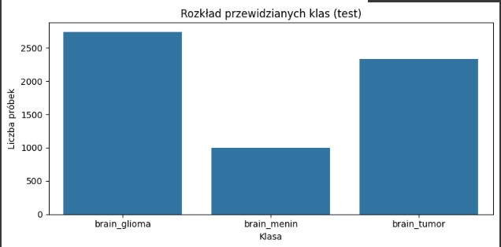

# Projekt-Koncowy 🧠
Automatyczna klasyfikacja guzów mózgu na podstawie obrazów MRI 
z wykorzystaniem konwolucyjnych sieci neuronowych
---

# Agenda  
1. Cel stworzenia modelu
2. Zastosowane techniki
3. Dane i klasy guzów mózgu
4. Wyniki modelu (Optuna + CNN)
5. Kluczowe wnioski
6. Podsumowanie i rekomendacje

---
# 1. Cel stworzenia modelu
Celem projektu było opracowanie modelu głębokiego uczenia (Convolutional Neural Network, CNN), który automatycznie klasyfikuje obrazy MRI mózgu na trzy typy guzów: 
- glioma
- meningioma
- guzy przysadki.
- Model ma wspomóc diagnostykę radiologiczną poprzez: przyspieszenie procesu analizy obrazów,zwiększenie dokładności klasyfikacji, dostarczenie interpretowalnych wyników (np. macierz pomyłek, F1 per klasa).
Dodatkowo, projekt pokazuje jak można wykorzystać Optunę do automatycznej optymalizacji hiperparametrów, co zwiększa wiarygodność i powtarzalność wyników.
---
# 2. Zastosowane techniki
- Convolutional Neural Network (CNN) – standard w analizie obrazów medycznych.
- Optuna – automatyczna optymalizacja hiperparametrów (learning rate, optimizer, liczba filtrów).
- Augmentacja danych – rotacje, przesunięcia, zmiany jasności → poprawa uogólniania.
- Normalizacja – stabilizuje uczenie.
- BatchNormalization – przyspiesza zbieżność i stabilizuje gradienty.
- Dropout – redukuje ryzyko przeuczenia.
- EarlyStopping + ReduceLROnPlateau – zatrzymują trening w odpowiednim momencie i dostosowują learning rate.
- MLflow – śledzenie eksperymentów i logowanie wyników.
- tf.data.Dataset – wydajne ładowanie i przetwarzanie danych.
---
# 3. Dane i klasy guzów mózgu
---
# Przykłady obrazów używanych przez model 
- Takie przykłady służą do zobrazowania różnicy między zdrowymi i chorymi skanami w zadaniu automatycznej klasyfikacji czy wspomagania diagnostyki.
- Klasy gózów mózgu
- brain_glioma – Zawiera obrazy guzów glejowych, które powstają z komórek glejowych w mózgu. Mogą mieć różny stopień złośliwości.
- brain_menin – Zawiera obrazy meningiomów, czyli nowotworów wywodzących się z opon mózgowych. Często są łagodne, ale ich położenie może powodować poważne komplikacje.
- brain_tumor – Prawdopodobnie folder zawiera mieszane przypadki różnych nowotworów mózgu, bez podziału na konkretny typ.

- **Wizualizacja:**

---
# Wizualizacja zdrowy i chory mózg 

- **Wizualizacja:**

---
# 4. Wyniki modelu (Optuna + CNN)
---

# Wykres dokładność modelu 

- **Wizualizacja:**

---
# Wykres krzywe strat 

- Na wykresie przedstawiono przebieg straty (loss) modelu uczenia maszynowego w trakcie treningu.
- Obie krzywe mają tendencję spadkową, co oznacza, że model uczy się i poprawia swoje wyniki w kolejnych epokach.
- 🔵 Niebieska linia pokazuje stratę na zbiorze treningowym (Train loss) – czyli jak dobrze model uczy się na danych, które zna.
- 🟠 Pomarańczowa linia pokazuje stratę na zbiorze walidacyjnym (Val loss) – czyli jak dobrze model radzi sobie na nowych danych, których wcześniej nie widział.

- **Wizualizacja:**

---
# Wykres heatmap validacja 

- **Wizualizacja:**

---
# Wykres F1 na walidacji podczas treningu
- Na wykresie przedstawiono, jak zmieniała się miara F1 (dokładniej: makro F1) modelu w trakcie procesu uczenia.
- Niebieska linia przedstawia przebieg wartości F1 w kolejnych epokach – czyli jak zmieniała się skuteczność modelu w trakcie uczenia.
- 🔵 Punkty naniesione na linię oznaczają konkretne wartości F1 w danej epoce – dzięki nim łatwo można odczytać i porównać wyniki między poszczególnymi etapami treningu.
- Opis wykresu F1 na walidacji podczas treningu: Na wykresie przedstawiono, jak zmieniała się miara F1 (dokładniej: makro F1) modelu w trakcie procesu uczenia.
- Widać lekkie wahania (np. spadek w epoce 5), ale ogólny trend jest wzrostowy, a od około 6. epoki wartości stabilizują się na wysokim poziomie.
- To sugeruje, że model osiągnął dobrą jakość i potrafi skutecznie klasyfikować dane walidacyjne.
  
- **Wizualizacja:**

---

# Heatmapa Macierz pomyłek (test)
- Opis heatmapy – macierz pomyłek (Confusion Matrix): Na wykresie przedstawiono macierz pomyłek, która pokazuje, jak model klasyfikacyjny poradził sobie z rozpoznawaniem trzech klas obrazów mózgu.
- Kolory kwadratów odzwierciedlają liczebność przypadków – im ciemniejszy kolor, tym więcej przykładów znajduje się w danej komórce.
- Wartości liczbowe w każdym kwadracie pokazują dokładną liczbę przypadków, np. ile obrazów z klasy brain_glioma zostało poprawnie rozpoznanych jako brain_glioma, a ile błędnie zaklasyfikowanych do innych klas.

- **Wizualizacja:**

---
# Wyniki modelu na dodatkowym zbiorze danych metryka optuna
-  Na Heatmapie  przedstawiono macierz pomyłek, która pokazuje, jak model klasyfikacyjny radzi sobie z rozpoznawaniem trzech klas obrazów mózgu: brain_glioma, brain_menin oraz brain_tumor.
- Kolory kwadratów odzwierciedlają liczebność przypadków – im ciemniejszy kolor, tym więcej przykładów znajduje się w danej komórce. 
- Wartości liczbowe w każdym kwadracie pokazują dokładną liczbę przypadków, np. ile obrazów z klasy brain_glioma zostało poprawnie rozpoznanych jako brain_glioma, a ile błędnie zaklasyfikowanych do innych klas.

- **Wizualizacja:**

---
# 5. Kluczowe wnioski
---
# Kluczowe wnioski
Augmentacja danych znacząco poprawia skuteczność.
BatchNormalization + Dropout → stabilność i dokładność.
Optuna pozwoliła dobrać optymalne hiperparametry (najlepszy wynik przy learning rate ≈ 1e-3).
F1-macro i confusion matrix pokazują, że model dobrze radzi sobie z wszystkimi klasami, choć najtrudniejsze są przypadki guzów przysadki.
System działa stabilnie nawet przy ograniczonym zbiorze danych.
---
# 6. Podsumowanie i rekomendacje
---
# Podsumowanie i rekomendacje
- Projekt z sukcesem stworzył dokładny i dobrze uogólniający model CNN do klasyfikacji guzów mózgu na podstawie obrazów MRI. System został:
przetestowany na rzeczywistych danych (BraTS),
wsparty narzędziami śledzenia eksperymentów (MLflow),
rozszerzony o interpretowalne wyniki (confusion matrix, F1 per klasa, histogramy).
- Rekomendacje na przyszłość:
Skalowanie na większe i bardziej zróżnicowane zbiory MRI (np. 3D NIfTI).
Wykorzystanie modeli przetrenowanych (EfficientNet, ResNet).
Integracja z systemem PACS szpitalnym.
Rozszerzenie o segmentację (lokalizacja guza).
---

  

  

